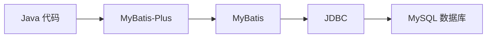

# MyBatis-Plus 数据库操作

## 概述

MyBatis-Plus（简称 MP）是基于 MyBatis 的增强工具，在 MyBatis 基础上只做增强不做改变，简化了开发。核心价值：**单表 CRUD 无需手写 SQL**，同时保留 MyBatis XML 自定义 SQL 的能力。

- 官网：https://baomidou.com/
- 基于 MyBatis，MyBatis 基于 JDBC
- MyBatis 简化 JDBC，MP 简化 MyBatis



## 全局配置

### 依赖配置

```XML
<!-- MySQL 驱动 -->
<dependency>
    <groupId>com.mysql</groupId>
    <artifactId>mysql-connector-j</artifactId>
    <scope>runtime</scope>
</dependency>

<!-- MyBatis-Plus 核心（SpringBoot3 专用 starter） -->
<dependency>
    <groupId>com.baomidou</groupId>
    <artifactId>mybatis-plus-spring-boot3-starter</artifactId>
    <version>3.5.17</version>
</dependency>

<!-- 分页插件（3.5.9+ 必须单独引入） -->
<dependency>
    <groupId>com.baomidou</groupId>
    <artifactId>mybatis-plus-jsqlparser</artifactId>
    <version>3.5.17</version>
</dependency>

<!-- Lombok -->
<dependency>
    <groupId>org.projectlombok</groupId>
    <artifactId>lombok</artifactId>
    <version>1.18.38</version>
</dependency>
```

### application.yaml

```YAML
spring:
  datasource:
    driver-class-name: com.mysql.cj.jdbc.Driver  # MySQL 8.x 驱动
    url: jdbc:mysql://localhost:3306/web01        # 连接地址：协议://主机:端口/数据库
    username: root                                 # 数据库用户名
    password: root                                 # 数据库密码

mybatis-plus:
  configuration:
    log-impl: org.apache.ibatis.logging.stdout.StdOutImpl  # SQL 日志打印到控制台
  mapper-locations: classpath:/mapper/**/*.xml             # XML 映射文件扫描路径
```

### 启动类

```Java
@SpringBootApplication   // @Configuration + @EnableAutoConfiguration + @ComponentScan
public class MpApplication {
    public static void main(String[] args) {
        SpringApplication.run(MpApplication.class, args);
    }
}
```

### 实体类

```Java
@TableName("user")  // 映射数据库表名，类名与表名不一致时必须指定
@Data
public class User {
    private Integer id;         // 主键，对应 user.id 列
    private String username;    // 用户名
    private String password;    // 密码
    private String name;        // 姓名
    private Integer age;        // 年龄
    // 属性名与列名采用驼峰-下划线自动映射
    // 不一致时用 @TableField("列名") 手动指定
}
```

### 实体类注解汇总

| 注解 | 作用 | 场景 |
|------|------|------|
| `@TableName("表名")` | 指定数据库表 | 类名 ≠ 表名时 |
| `@TableId(value, type)` | 指定主键列及策略 | 主键名不一致或需自定义策略 |
| `@TableField("列名")` | 指定普通字段映射 | 列名 ≠ 属性名时 |
| `@TableField(exist = false)` | 声明非数据库字段 | 实体中有不属于表的属性 |

### 主键生成策略（@TableId）

```Java
@TableId(value = "id", type = IdType.AUTO)
private Long id;
```

| 策略 | 说明 |
|------|------|
| `AUTO` | 数据库 auto_increment 自增 |
| `INPUT` | 手动赋值，插入前必须 set |
| `ASSIGN_ID` | 雪花算法，生成 Long 纯数字（默认策略） |
| `ASSIGN_UUID` | 生成 UUID 字符串 |
| `NONE` | 先判断是否手动赋值，否则雪花算法 |

### Mapper 接口

```Java
@Mapper  // 自动生成实现类并注册到 Spring IOC 容器
public interface UserMapper extends BaseMapper<User> {
    // 继承 BaseMapper 自动获得全部单表 CRUD 方法，无需手写实现类
}
```

> **@Mapper vs @MapperScan**：`@Mapper` 逐个注册，`@MapperScan("包路径")` 加在启动类上批量扫描，两者选其一。

### Wrapper 对比

| 类型 | 区别 |
|------|------|
| `QueryWrapper` | 字段名用字符串，如 `wrapper.eq("name", "张三")` |
| `LambdaQueryWrapper` | 字段名用方法引用，如 `wrapper.eq(User::getName, "张三")`，重构安全 |
| `LambdaUpdateWrapper` | 同上，用于 update 操作 |

> **推荐始终使用 Lambda 格式**，避免字段名硬编码导致的拼写错误。

---

## 插入（Insert）

### 基本插入

```Java
User user = new User();
user.setUsername("zhangsan");
user.setPassword("123456");
user.setName("张三");
user.setAge(20);
userMapper.insert(user);  // 插入成功后自动回填主键到 user.id
```

### 自定义 SQL 插入

注解方式：

```Java
@Insert("INSERT INTO user(username, password, age) VALUES(#{username}, #{password}, #{age})")
void saveUser(User user);
```

---

## 查询（Select）

### 查询方法汇总

| 方法 | 说明 | 返回值 |
|------|------|--------|
| `selectById(Serializable id)` | 根据主键查询一条记录 | `T`（实体对象） |
| `selectBatchIds(Collection idList)` | 根据主键 ID 集合批量查询（`IN` 查询） | `List<T>` |
| `selectByMap(Map<String, Object> map)` | 根据 columnMap 条件查询（key 为列名，value 为列值） | `List<T>` |
| `selectOne(Wrapper<T> queryWrapper)` | 条件查询单条记录（结果超过 1 条会报错） | `T`（实体对象） |
| `selectList(Wrapper<T> queryWrapper)` | 条件查询多条记录，传 `null` 则查询全部 | `List<T>` |
| `selectCount(Wrapper<T> queryWrapper)` | 条件查询总记录数，传 `null` 则统计全部 | `Long` |
| `selectPage(Page<T> page, Wrapper<T> queryWrapper)` | 条件分页查询（需配置分页插件） | `Page<T>` |

> 以上方法均来自 BaseMapper 接口，直接通过 Mapper 对象调用即可，无需编写 XML。


### 按 ID 查询

```Java
User user = userMapper.selectById(1);           // 单个查询
List<User> users = userMapper.selectByIds(List.of(1, 2, 3));  // 批量查询
```

### 条件查询

```Java
// 查全部
List<User> all = userMapper.selectList(null);

// Lambda 条件查询
LambdaQueryWrapper<User> wrapper = new LambdaQueryWrapper<>();
wrapper.eq(User::getName, "张三");  // WHERE name = '张三'
List<User> list = userMapper.selectList(wrapper);
```


#### 条件构造方法说明

MybatisPlus 提供了如下方法来设置查询条件：

#### 条件构造方法说明

MybatisPlus 提供了如下方法来设置查询条件：

| 查询方法 | 说明 | 示例 |
|------|------|------|
| `eq(R, val)` | 等于 (=) | `eq("name", "老王")` --> name = `老王` |
| `ne(R, val)` | 不等于 (!=) | `ne("age", 18)` --> age != 18 |
| `gt(R, val)` | 大于 (>) | `gt("age", 20)` --> age > 20 |
| `ge(R, val)` | 大于等于 (>=) | `ge("age", 20)` --> age >= 20 |
| `lt(R, val)` | 小于 (<) | `lt("age", 20)` --> age < 20 |
| `le(R, val)` | 小于等于 (<=) | `le("age", 20)` --> age <= 20 |
| `isNull(R)` | 判断为 NULL | `isNull("name")` --> name IS NULL |
| `isNotNull(R)` | 判断不为 NULL | `isNotNull("name")` --> name IS NOT NULL |
| `like(R, val)` | 模糊匹配 (前后%) | `like("name", "王")` --> name like `%王%` |
| `notLike(R, val)` | 模糊不匹配 | `notLike("name", "王")` --> name NOT like `%王%` |
| `likeLeft(R, val)` | 左模糊 (前%) | `likeLeft("name", "王")` --> name like `%王` |
| `likeRight(R, val)` | 右模糊 (后%) | `likeRight("name", "王")` --> name like `王%` |
| `in(R, coll)` | 包含 (IN) | `in("age", [18,20,22])` --> age in (18,20,22) |
| `notIn(R, coll)` | 不包含 (NOT IN) | `notIn("age", [18,20])` --> age NOT in (18,20) |
| `between(R, v1, v2)` | 在范围内 (BETWEEN) | `between("age", 18, 25)` --> age BETWEEN 18 AND 25 |
| `notBetween(R, v1, v2)` | 不在范围内 | `notBetween("age", 18, 25)` --> age NOT BETWEEN 18 AND 25 |
| `or()` | 或逻辑拼接 | `eq("id",1).or().eq("name","老王")` --> id = 1 or name = `老王` |
| `and()` | 与逻辑拼接（默认） | `eq("id",1).and().eq("name","老王")` --> id = 1 AND name = `老王` |

### 动态条件查询

根据传入参数动态拼接条件，字段为空则不拼接：

```Java
LambdaQueryWrapper<User> wrapper = new LambdaQueryWrapper<>();
wrapper.eq(user.getId() != null, User::getId, user.getId())
       .like(StringUtils.isNotBlank(user.getUsername()), User::getUsername, user.getUsername())
       .eq(user.getAge() != null, User::getAge, user.getAge());

List<User> list = userMapper.selectList(wrapper);
```

> **StringUtils 来源**：MP 自带 `com.baomidou.mybatisplus.core.toolkit.StringUtils`，也常用 `org.apache.commons.lang3.StringUtils`。

### 投影与排序

只查指定列，按年龄降序排列：

```Java
LambdaQueryWrapper<User> wrapper = new LambdaQueryWrapper<>();
wrapper.select(User::getName, User::getAge);  // 只返回 name 和 age
wrapper.orderByDesc(User::getAge);            // 按年龄降序

List<User> list = userMapper.selectList(wrapper);
// SELECT name, age FROM user ORDER BY age DESC
```

### 分页查询

#### 配置分页拦截器

```Java
@Configuration
public class MybatisPlusConfig {

    @Bean
    public MybatisPlusInterceptor mybatisPlusInterceptor() {
        MybatisPlusInterceptor interceptor = new MybatisPlusInterceptor();
        interceptor.addInnerInterceptor(new PaginationInnerInterceptor(DbType.MYSQL));
        return interceptor;
    }
}
```

#### 查询代码

查询第 2 页（每页 3 条），条件为 id > 1：

```Java
Page<User> page = new Page<>(2, 3);  // current=2 第2页，size=3 每页3条

LambdaQueryWrapper<User> wrapper = new LambdaQueryWrapper<>();
wrapper.gt(User::getId, 1);

page = userMapper.selectPage(page, wrapper);

System.out.println("总条数：" + page.getTotal());      // SELECT COUNT(*) 的结果
System.out.println("总页数：" + page.getPages());
System.out.println("当前页数据：" + page.getRecords());
```

### 自定义 SQL 查询

#### 注解方式

```Java
@Select("SELECT age, COUNT(1) AS num FROM user GROUP BY age")
List<Map<String, Integer>> countAge();
```

#### XML 方式

**规范要求**：namespace = Mapper 接口全限定名，sql id = 方法名，resultType = 返回值全限定名。

Mapper 接口：

```Java
List<User> selectByNameAndAge(String name, Integer age);
```

XML 映射文件（`resources/mappers/UserMapper.xml`）：

```XML
<?xml version="1.0" encoding="UTF-8" ?>
<!DOCTYPE mapper PUBLIC "-//mybatis.org//DTD Mapper 3.0//EN"
        "https://mybatis.org/dtd/mybatis-3-mapper.dtd">

<mapper namespace="com.itheima.mapper.UserMapper">

    <select id="selectByNameAndAge" resultType="com.itheima.entity.User">
        SELECT * FROM user
        WHERE
        CONCAT(#{name}, '%') AND age > #{age}
    </select>

</mapper>
```

---

## 更新（Update）

### 按 ID 更新

```Java
User user = new User();
user.setId(1);
user.setName("李四");
userMapper.updateById(user);  // 只更新 name，其余字段为 null 不会更新
```

### 条件更新

按姓名找到赵云，修改年龄和密码：

```Java
LambdaUpdateWrapper<User> updateWrapper = new LambdaUpdateWrapper<>();
updateWrapper.eq(User::getName, "赵云");
User user = new User();
user.setAge(10);
user.setPassword("123123");
userMapper.update(user, updateWrapper);
```

### 将字段显式更新为 null

`updateById` 只更新非 null 字段。要将字段设为 null，必须用 `update(entity, wrapper)` + `set`：

```Java
LambdaUpdateWrapper<User> wrapper = new LambdaUpdateWrapper<>();
wrapper.set(User::getPassword, null);
userMapper.update(null, wrapper);
```

---

## 删除（Delete）

### 按 ID 删除

```Java
userMapper.deleteById(1);                           // 单个删除
userMapper.deleteByIds(List.of(1, 2, 3));           // 批量删除
```

### 条件删除

```Java
LambdaQueryWrapper<User> wrapper = new LambdaQueryWrapper<>();
wrapper.eq(User::getName, "赵云");
userMapper.delete(wrapper);
```

---

## 动态 SQL

### `<where>` + `<if>` —— 动态条件

根据传入参数动态拼接 WHERE 条件，所有 if 都不成立时查全部：

```XML
<select id="selectByUser" resultType="com.itheima.entity.User">
    SELECT * FROM user

    <where>
        <if test="id != null">
            id = #{id}
        </if>
        <if test="username != null and username != ''">
            AND username LIKE CONCAT('%', #{username}, '%')
        </if>
        <if test="name != null and name != ''">
            AND name LIKE CONCAT('%', #{name}, '%')
        </if>
        <if test="age != null">
            AND age = #{age}
        </if>
    </where>
</select>
```

### `<foreach>` —— 批量操作

遍历集合，动态拼接 IN 子句：

```XML
<delete id="deleteBatchIds">
    DELETE FROM user WHERE id IN

    <foreach collection="idList" item="item" separator="," open="(" close=")">
        #{item}
    </foreach>
</delete>
```

| 属性 | 说明 |
|------|------|
| `collection` | 要遍历的集合/数组参数名 |
| `item` | 每次遍历的元素变量名 |
| `open` | 拼接的开头字符 `(` |
| `close` | 拼接的结尾字符 `)` |
| `separator` | 元素间分隔符 `,` |

---

*最后更新：2026-09-02*
