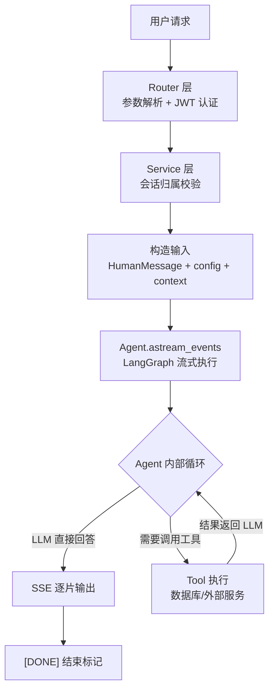

## 概述
基于 LangChain + LangGraph + FastAPI 构建的**标准智能体（Agent）服务模板**。涵盖：Agent 初始化、工具定义、Context 注入、Checkpointer 会话记忆、SSE 流式对话、会话管理。可直接复制改造，替换业务逻辑即可上线。

## 目录结构

```
agent-service/
├── pyproject.toml                    # 项目依赖配置
├── .env                              # 环境变量（不入库）
└── app/
    ├── main.py                       # 应用入口：lifespan 管理资源生命周期
    ├── core/
    │   ├── config.py                 # Pydantic Settings 分层配置
    │   ├── logging.py                # structlog 日志
    │   ├── security.py               # JWT + 密码哈希
    │   └── exceptions.py             # 业务异常基类
    ├── common/
    │   ├── models.py                 # ORM 基类 + 时间戳混入
    │   └── schemas.py                # Pydantic 基类 + 泛型分页
    ├── infra/
    │   ├── database.py               # 异步数据库引擎 + 会话工厂
    │   └── checkpointer.py           # Checkpointer 连接池（AsyncPostgresSaver）
    ├── agents/
    │   ├── advisor.py                # Agent 初始化（create_agent）
    │   ├── schemas.py                # Agent 运行时上下文
    │   └── tools.py                  # Agent 可调用的工具函数
    └── modules/
        ├── chat/                     # 对话接口（SSE 流式）
        ├── chat_thread/              # 会话 CRUD
        ├── auth/                     # 用户认证
        └── your_module/              # 你的业务模块
```

---

## 一、Agent 初始化

Agent 的核心是把**模型 + 工具 + 系统提示词 + 会话记忆**组装在一起。LangChain 的 `create_agent` 一行搞定。

```python
"""agents/advisor.py — 智能体初始化模块"""

from langchain.agents import create_agent                    # LangChain 工厂函数：组装模型/工具/提示词/记忆为 Agent
from langchain.chat_models import init_chat_model             # 统一模型初始化接口，支持多提供商
from langgraph.checkpoint.postgres.aio import AsyncPostgresSaver  # 基于 PostgreSQL 的异步会话状态检查点存储器

from app.agents.schemas import AgentContext                   # 运行时上下文 schema（如 user_id）
from app.core.config import settings                         # 全局配置：模型名称、API 密钥等
from app.agents.tools import tool_a, tool_b                  # 工具函数集合


# 系统提示词：定义 Agent 角色、行为准则、回复风格
SYSTEM_PROMPT = """
你是XX助手。
请使用专业、准确、易懂的语言回答用户问题。
当信息不足时，先向用户追问，不要编造内容。
"""


def init_agent(checkpointer: AsyncPostgresSaver):
    """初始化智能体。

    Args:
        checkpointer: 会话状态检查点存储器，实现跨请求的对话记忆。
            传入 None 则无记忆（每次对话独立）。

    Returns:
        编译后的 LangGraph 状态图（CompiledStateGraph），挂载到 app.state.agent 供路由层调用。
    """
    # 初始化聊天模型
    model = init_chat_model(
        model=settings.llm.chat_model,               # 模型名称，从环境变量 CHAT_MODEL 读取
        model_provider="deepseek",                   # 模型提供商（deepseek / openai / ollama 等）
        api_key=settings.llm.api_key,                # API 密钥，从环境变量读取
        extra_body={"thinking": {"type": "disabled"}},  # DeepSeek 特有：禁用思考链
    )

    # 创建 Agent：将模型、工具、提示词、记忆组装为完整的智能体
    agent = create_agent(
        model=model,                                 # 聊天模型实例
        tools=[tool_a, tool_b],                      # 工具列表，Agent 可自动选择调用
        system_prompt=SYSTEM_PROMPT,                 # 系统提示词
        checkpointer=checkpointer,                   # 会话记忆存储器
        context_schema=AgentContext,                 # 运行时上下文（工具可读取 user_id 等）
    )
    return agent
```

---

## 二、工具定义

工具 = 一个 Python 函数，Agent 在对话中根据用户意图自动决定是否调用。

### 基础工具（纯逻辑）
```python
"""agents/tools.py — Agent 工具函数"""

from decimal import Decimal                          # 精确十进制，避免浮点精度问题

from fastapi.encoders import jsonable_encoder        # 将 ORM/Pydantic 对象转为 JSON 兼容的字典
from langchain.tools import tool                     # @tool 装饰器：将函数注册为 Agent 可调用的工具
from langgraph.prebuilt import ToolRuntime           # 工具运行时上下文：提供对 Agent context 的访问

from app.agents.schemas import AgentContext          # 运行时上下文 schema


@tool
def 查询产品(分类: str, 价格上限: Decimal | None = None) -> list[dict]:
    """查询指定分类的候选产品。

    Agent 在以下场景调用此工具：
    - 用户咨询具体产品时
    - 需要为用户推荐产品时

    Args:
        分类: 产品分类，如 medical（医疗险）、life（寿险）。
        价格上限: 最高价格，可选。None 表示不限制。

    Returns:
        产品列表，每个元素包含名称、价格、描述等字段。
    """
    # 执行业务查询逻辑
    products = do_query(分类, 价格上限)
    # jsonable_encoder 将 ORM 对象转为字典列表，方便模型阅读
    return jsonable_encoder(products)
```

### 异步工具（调用数据库/外部服务）
```python
@tool
async def 保存方案(
    数据: dict,
    runtime: ToolRuntime[AgentContext],               # 运行时上下文，可获取 user_id 等后端注入的字段
) -> dict:
    """保存当前用户的业务数据。

    Args:
        数据: 由 Agent 根据用户需求生成的业务数据，模型自动填充。
        runtime: 运行时上下文。通过 runtime.context.user_id 获取当前用户 ID，
            该字段由后端注入，不出现在模型可见的参数中。

    Returns:
        包含 id 和 message 的结果字典。
    """
    async with AsyncSessionFactory() as session:      # 创建异步数据库会话
        service = SomeService(session)
        record_id = await service.create(
            user_id=runtime.context.user_id,          # 从上下文获取用户 ID（后端注入，模型无法伪造）
            data=数据,
        )
    return {"id": str(record_id), "message": "保存成功"}
```

### 工具定义要点
- `@tool` 装饰器必须有**文档注释**（作为工具描述发给模型），包含 `Args` 说明每个参数
- 需要数据库/外部服务的工具用 `async def`，调用时必须用 `ainvoke` / `astream_events`
- 需要用户身份等后端信息时，通过 `ToolRuntime[ContextSchema]` 注入，**不要让模型自己生成**
- 返回值用 `jsonable_encoder` 序列化，确保 JSON 兼容

---

## 三、运行时上下文（Context）

Context = 后端注入、模型不可见的信息（如 user_id、tenant_id）。工具通过 `ToolRuntime` 读取。

```python
"""agents/schemas.py — 运行时上下文定义"""

from dataclasses import dataclass


@dataclass(frozen=True)                              # frozen=True：创建后不可修改，保证安全性
class AgentContext:
    """Agent 运行时上下文。创建后不可变。"""
    user_id: int                                     # 当前登录用户的 ID（由后端从 JWT 中解析）
```

---

## 四、会话记忆（Checkpointer）

Checkpointer 持久化 Agent 对话状态，实现跨请求的记忆。基于 `thread_id` 隔离不同会话。

### 内存版（开发/测试）
```python
from langgraph.checkpoint.memory import InMemorySaver

agent = create_agent(model=model, checkpointer=InMemorySaver())  # 重启丢失
```

### PostgreSQL 版（生产）
```python
"""infra/checkpointer.py — 基于 PostgreSQL 的检查点连接池"""

from langgraph.checkpoint.postgres.aio import AsyncPostgresSaver  # 异步检查点存储器
from psycopg.rows import dict_row                                 # 查询结果以 dict 返回
from psycopg_pool import AsyncConnectionPool                      # psycopg 异步连接池

# 独立连接池：Checkpointer 用 psycopg 驱动，与 SQLAlchemy 的 asyncpg 不同，必须独立连接池
checkpoint_pool = AsyncConnectionPool(
    conninfo="postgresql://用户:密码@主机:端口/库名",   # psycopg 协议格式（注意不是 postgresql+asyncpg）
    min_size=1,                            # 最小连接数
    max_size=5,                            # 最大连接数
    kwargs={
        "autocommit": True,                # 自动提交，checkpoint 操作不需要手动事务
        "prepare_threshold": 0,            # 禁用预编译语句
        "row_factory": dict_row,           # 结果以 dict 返回
    },
    open=False,                            # 懒加载，不立即建立连接
)


async def init_checkpointer() -> AsyncPostgresSaver:
    """应用启动时调用：打开连接池 + 创建 checkpoint 表"""
    await checkpoint_pool.open()           # 建立初始连接
    await checkpoint_pool.wait()           # 等待连接就绪
    checkpointer = AsyncPostgresSaver(checkpoint_pool)
    await checkpointer.setup()             # 幂等建表（已存在则跳过）
    return checkpointer


async def close_checkpointer() -> None:
    """应用关闭时调用：释放连接池"""
    await checkpoint_pool.close()
```

> Windows 注意：psycopg 异步不能用 ProactorEventLoop，启动时需指定 `SelectorEventLoop`，用 `python -m app.main` 启动。

### 读取/删除会话
```python
# 读取最新状态
config = {"configurable": {"thread_id": "会话ID"}}
snapshot = await agent.aget_state(config)
messages = snapshot.values.get("messages", [])

# 删除会话全部历史
await checkpointer.adelete_thread("会话ID")
```

---

## 五、应用入口（lifespan）

通过 FastAPI lifespan 管理资源的初始化和释放顺序。

```python
"""main.py — 应用入口"""

import sys
from contextlib import asynccontextmanager

import uvicorn
from fastapi import FastAPI
from fastapi.middleware.cors import CORSMiddleware

from app.agents.advisor import init_agent               # Agent 初始化函数
from app.infra.checkpointer import (                    # Checkpointer 生命周期管理
    init_checkpointer, close_checkpointer,
)


@asynccontextmanager
async def lifespan(app: FastAPI):
    """应用生命周期：启动时初始化资源，关闭时释放"""

    from app.infra.database import check_database, close_database  # 延迟导入避免循环依赖

    try:
        await check_database()                          # 1. 检查数据库连接
        checkpointer = await init_checkpointer()        # 2. 初始化 Checkpointer 连接池
        app.state.agent = init_agent(checkpointer)      # 3. 初始化 Agent，挂载到 app.state
        yield                                            # 应用运行中...
    finally:
        await close_checkpointer()                      # 4. 关闭 Checkpointer 连接池
        await close_database()                          # 5. 关闭 SQLAlchemy 连接池


app = FastAPI(title="智能体服务", lifespan=lifespan)

# 路由注册
app.include_router(chat_router)                         # 对话接口
app.include_router(chat_thread_router)                  # 会话管理
app.include_router(auth_router)                         # 认证接口

# CORS 配置
app.add_middleware(
    CORSMiddleware,
    allow_origins=["http://127.0.0.1:5173"],           # 前端开发地址
    allow_credentials=True,                             # 允许 Cookie / Authorization
    allow_methods=["*"],
    allow_headers=["*"],
)


if __name__ == "__main__":
    uvicorn.run(
        "app.main:app",
        host="127.0.0.1",
        port=8001,
        loop="asyncio:SelectorEventLoop" if sys.platform == "win32" else "auto",
        # Windows 必须用 SelectorEventLoop
    )
```

---

## 六、对话接口（SSE 流式）

### Service 层
```python
"""modules/chat/service.py — 对话业务逻辑"""

from collections.abc import AsyncIterator

from fastapi.sse import ServerSentEvent                    # SSE 事件对象
from langchain_core.messages import HumanMessage           # LangChain 消息类型
from langgraph.graph.state import CompiledStateGraph       # 编译后的状态图类型（即 Agent）
from sqlalchemy.ext.asyncio import AsyncSession            # 异步数据库会话

from app.agents.schemas import AgentContext                # 运行时上下文
from app.modules.chat.schemas import ChatRequest           # 请求体 schema


class ChatService:
    def __init__(self, session: AsyncSession, agent: CompiledStateGraph):
        self.session = session
        self.agent = agent

    async def chat(
        self,
        user_id: int,
        request: ChatRequest,
    ) -> AsyncIterator[ServerSentEvent]:
        """流式对话：校验会话 → 构造输入 → 流式调用 Agent → 逐条返回 SSE 事件"""

        # 1. 校验会话归属（确保属于当前用户）
        # ... find_owned(request.thread_id, user_id) ...

        # 2. 构造 Agent 输入
        _input = {"messages": [HumanMessage(content=request.message)]}  # 标准输入格式：dict + messages 列表
        config = {"configurable": {"thread_id": str(request.thread_id)}}  # thread_id 控制会话记忆隔离
        context = AgentContext(user_id=user_id)                          # 运行时上下文（user_id）

        # 3. 流式调用 Agent
        result = await self.agent.astream_events(
            _input,                      # 输入消息
            config,                      # 会话配置（thread_id）
            context=context,             # 运行时上下文
            version="v3",                # 事件流协议版本
        )

        # 4. 逐条产出 SSE 事件
        async for message in result.messages:        # 遍历 Agent 返回的消息流
            async for text in message.text:          # 每条消息可能包含多个文本片段
                yield ServerSentEvent(data=text, event="message")

        # 5. 发送结束标记
        yield ServerSentEvent(data="[DONE]", event="done")
```

### Router 层
```python
"""modules/chat/router.py — 对话 HTTP 路由"""

from fastapi import APIRouter, Depends, Request
from fastapi.sse import EventSourceResponse             # SSE 响应类型
from sqlalchemy.ext.asyncio import AsyncSession

from app.infra.database import get_session              # 数据库会话依赖
from app.modules.auth.dependencies import get_current_user  # JWT 认证依赖
from app.modules.chat.service import ChatService


router = APIRouter(prefix="/api/v1/chat", tags=["对话接口"])


async def get_chat_service(
    request: Request,                                   # 读取 app.state.agent
    session: AsyncSession = Depends(get_session),
) -> ChatService:
    """依赖工厂：创建 ChatService，注入数据库会话和 Agent 实例"""
    return ChatService(
        session=session,
        agent=request.app.state.agent,                  # 从应用状态获取预初始化的 Agent
    )


@router.post("", response_class=EventSourceResponse)
async def chat(
    request: ChatRequest,                               # 请求体：thread_id + message
    user_id: User = Depends(get_current_user),          # JWT 认证：解析当前用户
    service: ChatService = Depends(get_chat_service),   # 注入对话服务
):
    """SSE 流式对话接口"""
    async for event in service.chat(user_id.id, request):
        yield event
```

---

## 七、依赖安装

```bash
# 核心依赖
uv add langchain langchain-deepseek                    # LangChain + DeepSeek 模型支持
uv add langgraph-checkpoint-postgres "psycopg[binary,pool]"  # PostgreSQL Checkpointer + psycopg 驱动

# 按需添加
uv add langchain-ollama                                # 本地 Ollama 模型
uv add python-dotenv                                   # .env 加载（Pydantic Settings 不回写环境变量）
uv add structlog                                       # 结构化日志
uv add pyjwt pwdlib                                    # JWT + 密码哈希
```

---

## 八、核心流程图



## 参考
- [[LangChain Agent 开发]] —— create_agent、工具定义、调用模式
- [[LangChain 记忆与持久化]] —— Checkpointer 详解
- [[LangChain 基础与模型]] —— 模型初始化
- [[SSE 流式响应]] —— FastAPI SSE 对接 AI 流式输出
- [[业务模块标准写法]] —— Router → Service → Repository 分层
- [[MCP 集成]] —— 通过 MCP 复用外部工具
- [[LangGraph 工作流编排]] —— 复杂工作流场景
