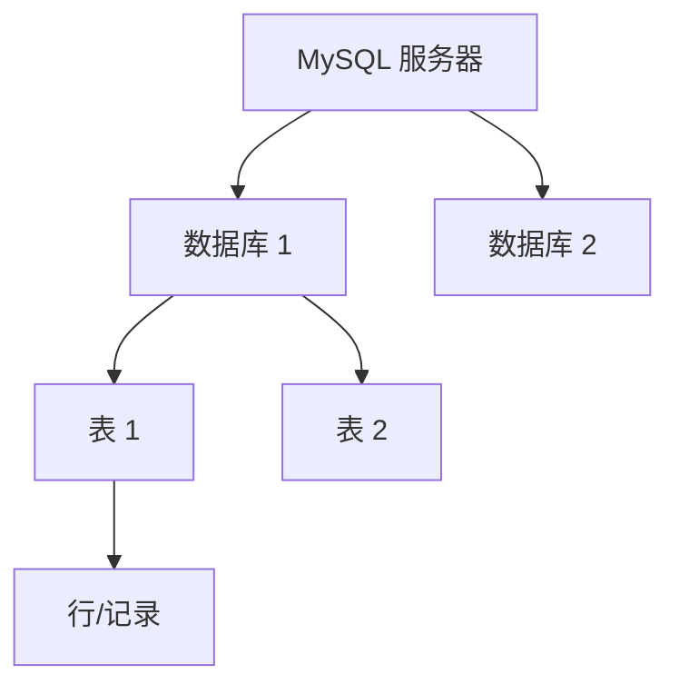

# MySQL 基础操作

## 概述

MySQL 是最流行的开源关系型数据库（RDBMS），基于二维表存储数据。核心工作流：程序员 → SQL 语句 → DBMS → 数据库。

**为什么不用文件存数据？** 并发冲突、查询性能低、维护困难、权限控制难、扩展受限。

## 数据模型



- 一个服务器 → 多个数据库 → 多张表 → 多行数据
- 操作层级：先建库 → 再建表 → 再存数据

## SQL 分类

| 分类 | 全称 | 用途 | 关键字 |
|------|------|------|--------|
| DDL | Data Definition Language | 定义数据库对象（库、表） | CREATE / ALTER / DROP |
| DML | Data Manipulation Language | 增删改表数据 | INSERT / UPDATE / DELETE |
| DQL | Data Query Language | 查询表数据 | SELECT |
| DCL | Data Control Language | 权限控制 | GRANT / REVOKE |

## DDL — 数据定义语言

### 数据库操作

```sql
-- 查询所有数据库
SHOW DATABASES;

-- 查询当前数据库
SELECT DATABASE();

-- 创建数据库（推荐加 IF NOT EXISTS）
CREATE DATABASE IF NOT EXISTS 数据库名 DEFAULT CHARSET utf8mb4;

-- 使用/切换数据库
USE 数据库名;

-- 删除数据库
DROP DATABASE IF EXISTS 数据库名;
```

### 表操作 — 创建

```sql
CREATE TABLE 表名 (
    字段1  类型  [约束]  [COMMENT '字段注释'],
    字段2  类型  [约束]  [COMMENT '字段注释'],
    ...
    字段n  类型  [约束]  [COMMENT '字段注释']
) COMMENT '表注释';
```

### 五大约束

| 约束 | 关键字 | 说明 | 示例 |
|------|--------|------|------|
| 非空 | `NOT NULL` | 字段值不允许为 NULL | `name VARCHAR(10) NOT NULL` |
| 唯一 | `UNIQUE` | 字段值不允许重复 | `username VARCHAR(20) UNIQUE` |
| 主键 | `PRIMARY KEY` | 唯一标识 + 非空 + 唯一（每表只有一个） | `id INT PRIMARY KEY` |
| 默认值 | `DEFAULT` | 未指定时使用默认值 | `gender CHAR(1) DEFAULT '男'` |
| 外键 | `FOREIGN KEY` | 关联另一张表的主键，保证数据一致性 | 见下方示例 |

```sql
-- 外键约束示例
CREATE TABLE 订单表 (
    id INT PRIMARY KEY AUTO_INCREMENT,
    user_id INT,
    CONSTRAINT fk_user FOREIGN KEY (user_id) REFERENCES 用户表(id)
);
```

### 主键自增

```sql
-- auto_increment：每次插入时自动生成主键值，从 1 开始递增
id INT PRIMARY KEY AUTO_INCREMENT
```

### 数据类型

**数值类型：**

```sql
-- 年龄（不会为负，不会太大）
age TINYINT UNSIGNED

-- 分数（总分100，最多1位小数）
score DOUBLE(4,1)
```

**字符串类型：**

- `CHAR(n)` — 定长，性能更高，适合长度固定的字段（如手机号 `CHAR(11)`）
- `VARCHAR(n)` — 变长，适合长度不固定的字段（如用户名 `VARCHAR(50)`）

**日期时间类型：**

```sql
birthday DATE          -- 只需年月日
createtime DATETIME    -- 精确到时分秒
```

### 表结构查询与修改

```sql
-- 查询
SHOW TABLES;                    -- 当前库所有表
DESC 表名;                      -- 表结构（字段、类型、约束等）
SHOW CREATE TABLE 表名;         -- 建表语句

-- 修改
ALTER TABLE 表名 ADD 字段名 类型 [COMMENT '注释'] [约束];     -- 添加字段
ALTER TABLE 表名 MODIFY 字段名 新类型;                         -- 修改类型
ALTER TABLE 表名 CHANGE 旧字段名 新字段名 新类型;              -- 改名+改类型
ALTER TABLE 表名 DROP 字段名;                                  -- 删除字段
RENAME TABLE 表名 TO 新表名;                                   -- 改表名

-- 删除
DROP TABLE IF EXISTS 表名;
```

## DML — 数据操作语言

### INSERT 增加

```sql
-- 指定字段插入
INSERT INTO 表名 (字段1, 字段2) VALUES (值1, 值2);

-- 全字段插入（顺序必须与建表一致）
INSERT INTO 表名 VALUES (值1, 值2, ...);

-- 批量插入
INSERT INTO 表名 (字段1, 字段2) VALUES (值1, 值2), (值1, 值2);

-- now() 获取当前时间
INSERT INTO employee VALUES (NULL, '张三', 1, 1, 5000, '2023-01-01', NOW(), NOW());
```

**注意：** 字段顺序与值一一对应；字符串和日期用引号；数据不能超出字段范围。

### UPDATE 修改

```sql
-- 更新指定行（必须加 WHERE）
UPDATE 表名 SET 字段1 = 值1, 字段2 = 值2 WHERE 条件;

-- 不加 WHERE 会更新整张表，慎用
UPDATE employee SET name = '张三丰', update_time = NOW() WHERE id = 1;
```

### DELETE 删除

```sql
-- 删除指定行
DELETE FROM 表名 WHERE 条件;

-- 删除整表数据（慎用）
DELETE FROM 表名;
```

**注意：** DELETE 不能删除某一个字段的值（用 UPDATE 设为 NULL）。

## DQL — 数据查询语言

DQL 是使用频率最高的 SQL 操作。完整语法结构：

```sql
SELECT  字段列表
FROM    表名
WHERE   条件列表
GROUP BY  分组字段
HAVING    分组后过滤条件
ORDER BY  排序字段  ASC/DESC
LIMIT     起始索引, 查询条数;
```

### 基本查询

```sql
-- 查询指定字段
SELECT name, entry_date FROM employee;

-- 别名
SELECT name AS 姓名, salary AS 薪资 FROM employee;

-- 去重
SELECT DISTINCT job FROM employee;
```

### 条件查询（WHERE）

```sql
-- 比较运算：=, <>, <, <=, >, >=
SELECT * FROM employee WHERE salary > 15000;

-- AND / OR
SELECT * FROM employee WHERE salary >= 15000 AND gender = 2;

-- BETWEEN ... AND ...（包含两端）
SELECT * FROM employee WHERE entry_date BETWEEN '2020-01-01' AND '2025-01-01';

-- IN（匹配列表中的任意值）
SELECT * FROM employee WHERE job IN (2, 3, 4);

-- LIKE 模糊匹配：% 匹配任意个字符，_ 匹配单个字符
SELECT * FROM employee WHERE name LIKE '李%';      -- 姓李
SELECT * FROM employee WHERE name LIKE '%小%';     -- 包含"小"
SELECT * FROM employee WHERE name LIKE '__';        -- 两个字

-- IS NULL / IS NOT NULL
SELECT * FROM employee WHERE job IS NULL;
```

### 聚合函数

对一列数据做纵向计算，忽略 NULL 值：

| 函数 | 说明 |
|------|------|
| `COUNT(*)` | 统计行数（推荐） |
| `SUM(字段)` | 求和 |
| `AVG(字段)` | 平均值 |
| `MAX(字段)` | 最大值 |
| `MIN(字段)` | 最小值 |

```sql
-- 示例：统计员工数量和平均薪资
SELECT COUNT(*) AS 员工数, AVG(salary) AS 平均薪资 FROM employee;
```

### 分组查询（GROUP BY）

```sql
-- 按性别分组，统计人数
SELECT gender, COUNT(*) FROM employee GROUP BY gender;

-- 分组前过滤 + 分组后过滤
SELECT job, COUNT(*)
FROM employee
WHERE entry_date <= '2015-01-01'   -- 分组前（WHERE）
GROUP BY job
HAVING COUNT(*) >= 2;             -- 分组后（HAVING）
```

**WHERE vs HAVING（面试题）：**

- `WHERE` 在分组**前**过滤，不能用聚合函数
- `HAVING` 在分组**后**过滤，可以用聚合函数
- 执行顺序：`WHERE` → 聚合函数 → `HAVING`

### 排序查询（ORDER BY）

```sql
-- 单字段排序（ASC 升序，DESC 降序，默认 ASC）
SELECT * FROM employee ORDER BY salary DESC;

-- 多字段排序：第一个字段相同才看第二个
SELECT * FROM employee ORDER BY entry_date ASC, salary DESC;
```

### 分页查询（LIMIT）

```sql
-- 语法：LIMIT 起始索引, 查询条数（起始索引从 0 开始）
SELECT * FROM employee LIMIT 0, 5;   -- 第 1 页，每页 5 条
SELECT * FROM employee LIMIT 5, 5;   -- 第 2 页
SELECT * FROM employee LIMIT 10, 5;  -- 第 3 页

-- 第一页可以省略起始索引
SELECT * FROM employee LIMIT 5;
```

**公式：** `起始索引 = (页码 - 1) × 每页条数`

**注意：** LIMIT 是 MySQL 方言，不同数据库实现不同。

## 事务

### 概念

事务是一组不可分割的操作集合，要么全部成功，要么全部失败。

**典型场景：** 银行转账、下单扣库存、涨薪+记日志。

**MySQL 默认自动提交：** 执行一条 DML 语句就会立即提交。

### 操作

```sql
-- 开启事务
START TRANSACTION;  -- 或 BEGIN;

-- 执行业务操作
UPDATE employee SET salary = salary + 2000 WHERE id = 5;
INSERT INTO employee_log(employee_id, operation, create_time)
    VALUES (5, 'update', NOW());

-- 全部成功 → 提交
COMMIT;

-- 任一失败 → 回滚（撤销所有操作）
ROLLBACK;
```

### ACID 四大特性

| 特性 | 英文 | 说明 |
|------|------|------|
| 原子性 | Atomicity | 事务中的操作要么全部成功，要么全部失败 |
| 一致性 | Consistency | 事务完成后数据保持一致状态 |
| 隔离性 | Isolation | 多个并发事务互不干扰 |
| 持久性 | Durability | 事务提交/回滚后，数据改变是永久的 |

## 最佳实践

- 建表时用 `IF NOT EXISTS` / `IF EXISTS` 避免重复操作报错
- 字段都加 `COMMENT` 注释，方便维护
- 主键统一用 `INT UNSIGNED AUTO_INCREMENT`
- 公共字段：`create_time`、`update_time` 记录操作时间
- 修改/删除数据**必须加 WHERE 条件**，否则影响整表
- 查询用 `SELECT 具体字段` 而非 `SELECT *`，更直观高效
- 分组查询的 SELECT 字段一般只放聚合函数和分组字段
- 涉及多步操作的业务必须用事务包裹

## 常见问题

| 问题 | 原因 | 解决方案 |
|------|------|----------|
| 插入数据报主键重复 | 未使用 `AUTO_INCREMENT` | 主键加 `AUTO_INCREMENT` |
| UPDATE/DELETE 没加 WHERE 改了全表 | 忘记加 WHERE 条件 | 始终带上 WHERE，执行前检查 |
| GROUP BY 报错 | SELECT 了非分组字段 | 只选聚合函数和分组字段 |
| LIKE 模糊查询没结果 | `%` 放错位置 | `%keyword%` 包含匹配 |
| 分页第一页数据重复 | 起始索引计算错误 | `索引 = (页码-1) × 条数` |
| 事务未回滚 | MySQL 默认自动提交 | 操作前 `START TRANSACTION` |
