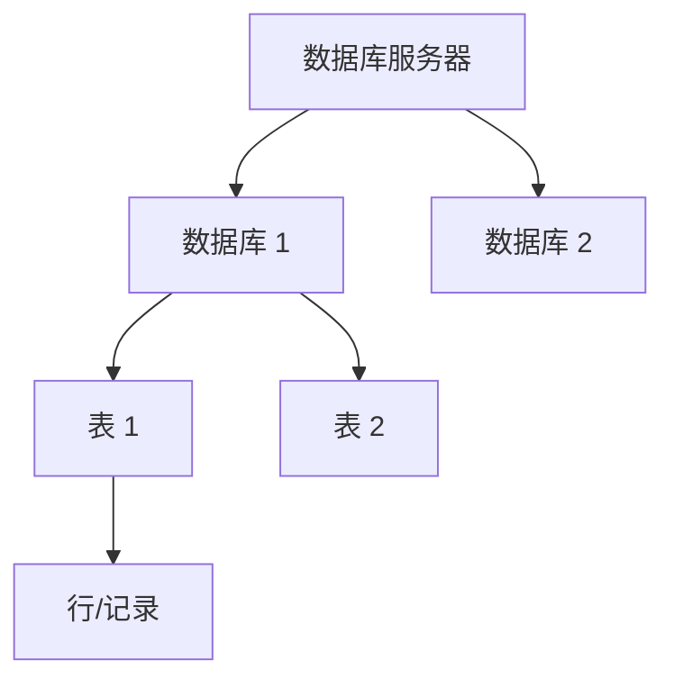

# SQL 语言全解

## 概述

SQL（Structured Query Language）是操作关系型数据库的标准语言。核心工作流：程序员 → SQL 语句 → DBMS → 数据库。

**为什么不用文件存数据？** 并发冲突、查询性能低、维护困难、权限控制难、扩展受限。

### 数据模型



- 一个服务器 → 多个数据库 → 多张表 → 多行数据
- 操作层级：先建库 → 再建表 → 再存数据

### SQL 分类

| 分类 | 全称 | 用途 | 关键字 |
|------|------|------|--------|
| DDL | Data Definition Language | 定义数据库对象（库、表） | CREATE / ALTER / DROP |
| DML | Data Manipulation Language | 增删改表数据 | INSERT / UPDATE / DELETE |
| DQL | Data Query Language | 查询表数据 | SELECT |
| DCL | Data Control Language | 权限控制 | GRANT / REVOKE |

---

## 一、DDL — 数据定义语言

### 1.1 数据库操作

```sql
-- SHOW DATABASES：查询并列出当前 MySQL 实例中的所有数据库
SHOW DATABASES;

-- SELECT DATABASE()：返回当前正在使用的数据库名称，未选择时返回 NULL
SELECT DATABASE();

-- CREATE DATABASE：创建新的数据库
-- IF NOT EXISTS：如果数据库已存在则跳过，避免报错
-- DEFAULT CHARSET utf8mb4：设置默认字符集为 utf8mb4，支持中文和 emoji
CREATE DATABASE IF NOT EXISTS 数据库名 DEFAULT CHARSET utf8mb4;

-- USE：切换当前会话到指定数据库，后续 SQL 都在该库中执行
USE 数据库名;

-- DROP DATABASE：删除整个数据库及其所有表和数据，不可恢复
-- IF EXISTS：如果数据库不存在则跳过，避免报错
DROP DATABASE IF EXISTS 数据库名;
```

### 1.2 表操作 — 创建

```sql
-- CREATE TABLE：创建新表
-- 每行定义一个字段：字段名 + 数据类型 + 可选约束 + 可选注释
CREATE TABLE 表名 (
    字段1  类型  [约束]  [COMMENT '字段注释'],   -- 第一个字段定义（类型如 INT/VARCHAR，约束如 PRIMARY KEY/NOT NULL）
    字段2  类型  [约束]  [COMMENT '字段注释'],   -- 第二个字段定义
    ...                                          -- 中间字段省略
    字段n  类型  [约束]  [COMMENT '字段注释']    -- 最后一个字段，注意末尾没有逗号
) COMMENT '表注释';                              -- 整张表的注释说明
```

### 1.3 五大约束

| 约束 | 关键字 | 说明 | 示例 |
|------|--------|------|------|
| 非空 | `NOT NULL` | 字段值不允许为 NULL | `name VARCHAR(10) NOT NULL` |
| 唯一 | `UNIQUE` | 字段值不允许重复 | `username VARCHAR(20) UNIQUE` |
| 主键 | `PRIMARY KEY` | 唯一标识 + 非空 + 唯一（每表只有一个） | `id INT PRIMARY KEY` |
| 默认值 | `DEFAULT` | 未指定时使用默认值 | `gender CHAR(1) DEFAULT '男'` |
| 外键 | `FOREIGN KEY` | 关联另一张表的主键，保证数据一致性 | 见下方示例 |

```sql
-- 外键约束示例：订单表通过 user_id 关联用户表
CREATE TABLE 订单表 (
    id INT PRIMARY KEY AUTO_INCREMENT,         -- INT 整数类型，PRIMARY KEY 主键，AUTO_INCREMENT 自增
    user_id INT,                                -- 用户 ID，作为外键指向用户表
    -- CONSTRAINT：命名外键约束（方便后续删除/修改）
    -- FOREIGN KEY (user_id)：指定当前表中哪个字段是外键
    -- REFERENCES 用户表(id)：引用用户表的 id 主键
    CONSTRAINT fk_user FOREIGN KEY (user_id) REFERENCES 用户表(id)
);
```

### 1.4 主键自增

```sql
-- INT：整数类型
-- PRIMARY KEY：主键约束，唯一标识每一行记录，不允许重复和 NULL
-- AUTO_INCREMENT：插入时自动生成主键值，从 1 开始递增，无需手动指定
id INT PRIMARY KEY AUTO_INCREMENT
```

### 1.5 数据类型

**数值类型：**

```sql
-- TINYINT：8 位有符号整数，范围 -128~127
-- UNSIGNED：无符号修饰，去掉负数部分，范围变为 0~255，适合非负整数字段
年龄字段 TINYINT UNSIGNED

-- DOUBLE(4,1)：浮点数类型，总共 4 位数字，其中小数部分占 1 位
-- 即最大可存 999.9，适合需要保留小数的数值字段
分数字段 DOUBLE(4,1)
```

**字符串类型：**

- `CHAR(n)` — 定长，性能更高，适合长度固定的字段（如手机号 `CHAR(11)`）
- `VARCHAR(n)` — 变长，适合长度不固定的字段（如用户名 `VARCHAR(50)`）

**日期时间类型：**

```sql
-- DATE：只存储年月日，不包含时间部分，格式为 'YYYY-MM-DD'
出生日期字段 DATE
-- DATETIME：存储年月日和时分秒，精确到秒，格式为 'YYYY-MM-DD HH:MM:SS'
创建时间字段 DATETIME
```

### 1.6 表结构查询与修改

```sql
-- ===== 查询表结构 =====
SHOW TABLES;                                              -- 列出当前数据库中的所有表名
DESC 表名;                                                -- 显示表的字段名、类型、是否可空、键、默认值等结构信息
SHOW CREATE TABLE 表名;                                   -- 查看创建该表的完整 SQL 语句（含引擎和字符集）

-- ===== 修改表结构 =====
-- ALTER TABLE：对已有表的结构进行变更
ALTER TABLE 表名 ADD 字段名 类型 [COMMENT '注释'] [约束]; -- ADD：在表中新增一列
ALTER TABLE 表名 MODIFY 字段名 新类型;                    -- MODIFY：修改已有字段的数据类型（不改名）
ALTER TABLE 表名 CHANGE 旧字段名 新字段名 新类型;          -- CHANGE：同时修改字段名和数据类型
ALTER TABLE 表名 DROP 字段名;                              -- DROP：删除表中的某一列，数据会丢失
RENAME TABLE 表名 TO 新表名;                               -- 将表名重命名为新名称

-- ===== 删除表 =====
DROP TABLE IF EXISTS 表名;                                -- 删除整张表的结构和数据，IF EXISTS 防止表不存在时报错
```

---

## 二、DML — 数据操作语言

### 2.1 INSERT 增加

```sql
-- INSERT INTO ... VALUES：向表中插入一条新记录
-- (字段1, 字段2)：指定要插入的列，未指定的列使用默认值或 NULL
-- VALUES (值1, 值2)：对应字段的值，顺序必须和字段列表一致
INSERT INTO 表名 (字段1, 字段2) VALUES (值1, 值2);

-- 不指定字段列表时，必须为所有列按建表顺序提供值
-- VALUES (值1, 值2, ...)：值的个数和顺序必须与表定义完全一致
INSERT INTO 表名 VALUES (值1, 值2, ...);

-- 批量插入：VALUES 后跟多组值，用逗号分隔，一次插入多条记录，比逐条插入效率高
INSERT INTO 表名 (字段1, 字段2) VALUES (值1, 值2), (值1, 值2);

-- 泛型示例：字段名和值均为占位符，实际使用时替换为具体列和值
INSERT INTO 表名 (字段1, 字段2, 字段3, 字段4, 字段5, 字段6) VALUES (值1, '字段值', 数值, 数值, 数值, 'YYYY-MM-DD');
```

**注意：** 字段顺序与值一一对应；字符串和日期用引号；数据不能超出字段范围。

### 2.2 UPDATE 修改

```sql
-- UPDATE ... SET：修改表中已有记录的字段值
-- SET：指定要更新的字段及其新值，多个字段用逗号分隔
-- WHERE：限定只更新满足条件的行，漏掉 WHERE 会更新所有行
UPDATE 表名 SET 字段1 = 值1, 字段2 = 值2 WHERE 条件;

-- 泛型示例：按条件修改指定字段的值
UPDATE 表名 SET 字段1 = '字段值', 字段2 = NOW() WHERE 条件;
```

### 2.3 DELETE 删除

```sql
-- DELETE FROM：从表中删除满足条件的记录
-- WHERE：指定删除条件，只删除符合条件的行
DELETE FROM 表名 WHERE 条件;

-- 不加 WHERE：删除表中所有行（数据清空，但表结构保留）
-- 注意：DELETE 不会重置 AUTO_INCREMENT 计数器
DELETE FROM 表名;
```

**注意：** DELETE 不会重置 AUTO_INCREMENT 计数器。

> `> 🔖 MySQL 特有` TRUNCATE TABLE 可同时清空数据并重置自增计数器，功能等同于 DELETE 全表但效率更高。

---

## 三、DQL — 数据查询语言

### 3.1 查询语法顺序

```sql
SELECT     字段列表       -- 要查询的列，* 表示所有列
FROM       表名           -- 从哪张表查询
WHERE      条件           -- 行级过滤，在分组前执行，不支持聚合函数
GROUP BY   分组字段       -- 按指定字段分组，常配合聚合函数使用
HAVING     分组后条件     -- 分组后的过滤条件，支持聚合函数
ORDER BY   排序字段  ASC/DESC  -- 结果排序：ASC 升序（默认），DESC 降序
LIMIT      起始索引, 查询条数; -- 分页，起始索引从 0 开始
```

### 3.2 基本查询

```sql
-- 查询指定字段：只返回姓名字段和入职日期字段两列，避免 SELECT *
SELECT 姓名字段,         -- 员工姓名
       入职日期字段        -- 入职日期
FROM 员工表;              -- 从员工表中查询

-- 使用 AS 起别名，让结果列名更易读（别名仅影响输出标题，不影响原表）
SELECT 姓名字段  AS 别名字段1,    -- 将姓名字段显示为指定别名
       薪资字段  AS 别名字段2     -- 将薪资字段显示为指定别名
FROM 员工表;                  -- 从员工表查询

-- DISTINCT 去除重复行：只返回职位字段中不重复的值
SELECT DISTINCT          -- 去重关键字，合并相同的职位值
       职位字段            -- 职位编号
FROM 员工表;               -- 从员工表查询
```

### 3.3 条件查询（WHERE）

```sql
-- 比较运算符筛选：找出薪资大于阈值的所有员工
SELECT *                        -- 返回所有列（生产环境建议写具体字段名）
FROM 员工表                     -- 从员工表查询
WHERE 薪资字段 > 15000;         -- 筛选条件：薪资字段 > 阈值

-- AND 多条件同时满足：薪资 >= 阈值 且性别为指定值（2 代表女）
SELECT *                              -- 返回所有列
FROM 员工表                           -- 从员工表查询
WHERE 薪资字段 >= 15000               -- 条件1：薪资大于等于阈值
  AND 性别字段 = 2;                   -- 条件2：性别为指定值（AND 要求两个条件同时成立）

-- BETWEEN 闭区间筛选：入职日期在起始日期到结束日期之间（含两端）
SELECT *                                -- 返回所有列
FROM 员工表                             -- 从员工表查询
WHERE 入职日期字段 BETWEEN '起始日期' AND '结束日期';
  -- 等价于 入职日期字段 >= '起始日期' AND 入职日期字段 <= '结束日期'

-- IN 列表匹配：职位编号为多个值中任意一个即可命中
SELECT *                                    -- 返回所有列
FROM 员工表                                 -- 从员工表查询
WHERE 职位字段 IN (1, 2, 3);                -- 职位字段等于列表中的任一值（等价于多个 OR）

-- LIKE 模糊匹配：% 匹配零个或多个任意字符，_ 匹配恰好一个任意字符
SELECT * FROM 员工表 WHERE 姓名字段 LIKE '某%';
  -- 匹配所有以「某」开头的记录：% 在末尾表示后面可以有任意字符
SELECT * FROM 员工表 WHERE 姓名字段 LIKE '%某%';
  -- 匹配包含「某」的记录：% 在两侧表示前后都可以有任意字符
SELECT * FROM 员工表 WHERE 姓名字段 LIKE '__';
  -- 匹配恰好两个字符的记录：每个 _ 代表一个字符

-- IS NULL 判断空值：找出职位字段为 NULL 的员工
SELECT *                           -- 返回所有列
FROM 员工表                        -- 从员工表查询
WHERE 职位字段 IS NULL;            -- 筛选职位字段为 NULL 的行（注意不能用 = NULL）
```

### 3.4 聚合函数

对一列数据做纵向计算，忽略 NULL 值：

| 函数 | 说明 |
|------|------|
| `COUNT(*)` | 统计行数（推荐） |
| `SUM(字段)` | 求和 |
| `AVG(字段)` | 平均值 |
| `MAX(字段)` | 最大值 |
| `MIN(字段)` | 最小值 |

```sql
-- 聚合函数对一列做纵向计算，自动忽略 NULL 值
SELECT COUNT(*)        AS 聚合结果,       -- COUNT(*) 统计总行数（含 NULL 行）
       AVG(薪资字段)   AS 聚合结果      -- AVG(薪资字段) 计算薪资字段的平均值，忽略 NULL
FROM 员工表;                            -- 从主表计算
```

### 3.5 分组查询（GROUP BY）

```sql
-- GROUP BY 将数据按指定字段分成若干组，每组再用聚合函数计算
SELECT 性别字段,                  -- 分组字段：按性别分组（1=男，2=女）
       COUNT(*)                  -- 聚合函数：统计每组的行数（即该性别的人数）
FROM 员工表                      -- 从员工表查询
GROUP BY 性别字段;               -- 按性别字段分组

-- 执行顺序：FROM → WHERE（分组前过滤）→ GROUP BY → 聚合 → HAVING（分组后过滤）
SELECT 职位字段,                              -- 分组字段：按职位编号分组
       COUNT(*)                              -- 聚合函数：统计每个职位的人数
FROM 员工表                                  -- 从员工表查询
WHERE 入职日期字段 <= '截止日期'              -- 分组前过滤：只纳入截止日期及之前入职的员工
GROUP BY 职位字段                            -- 按职位字段分组
HAVING COUNT(*) >= 2;                        -- 分组后过滤：只保留人数 >= 2 的职位（HAVING 可用聚合函数）
```

**WHERE vs HAVING（面试题）：**

- `WHERE` 在分组**前**过滤，不能用聚合函数
- `HAVING` 在分组**后**过滤，可以用聚合函数
- 执行顺序：`WHERE` → 聚合函数 → `HAVING`

### 3.6 排序查询（ORDER BY）

```sql
-- ORDER BY 对结果集排序：DESC 降序，ASC 升序（默认值可省略）
SELECT *                                  -- 返回所有列
FROM 员工表                               -- 从员工表查询
ORDER BY 薪资字段 DESC;                   -- 按薪资降序排列（工资最高的排最前）

-- 多字段排序：先按第一个字段排，相同值再按第二个字段排
SELECT *                                        -- 返回所有列
FROM 员工表                                     -- 从员工表查询
ORDER BY 入职日期字段 ASC,                       -- 第一排序键：入职日期升序（早入职的排前面）
         薪资字段 DESC;                          -- 第二排序键：入职日期相同时，薪资降序
```

### 3.7 分页查询（LIMIT）

> `> 🔖 MySQL 特有` LIMIT 是 MySQL/PostgreSQL 的方言语法，SQL Server 用 `TOP`，Oracle 用 `ROWNUM` 或 `FETCH FIRST`。

```sql
-- LIMIT 分页：起始索引从 0 开始，第二个参数是每页条数
SELECT * FROM 员工表 LIMIT 0, 5;   -- 第 1 页：从索引 0 开始取 5 条（第1~5条）
SELECT * FROM 员工表 LIMIT 5, 5;   -- 第 2 页：从索引 5 开始取 5 条（第6~10条）
SELECT * FROM 员工表 LIMIT 10, 5;  -- 第 3 页：从索引10开始取 5 条（第11~15条）

-- 省略起始索引时默认从 0 开始，效果等同于 LIMIT 0, 5
SELECT * FROM 员工表 LIMIT 5;      -- 第 1 页，每页 5 条
```

**公式：** `起始索引 = (页码 - 1) × 每页条数`

---

## 四、连接查询

### 4.1 连接分类

| 类型 | 关键字 | 说明 |
|------|--------|------|
| 内连接 | `INNER JOIN ... ON ...` | 返回两表中满足连接条件的交集数据 |
| 左外连接 | `LEFT JOIN ... ON ...` | 返回左表全部数据 + 右表满足条件的数据 |
| 右外连接 | `RIGHT JOIN ... ON ...` | 返回右表全部数据 + 左表满足条件的数据 |
| 自连接 | 同一张表与自身连接 | 用于层级关系查询 |
| 联合查询 | `UNION` / `UNION ALL` | 合并多条 SELECT 的结果 |

### 4.2 内连接

**隐式写法（WHERE 方式）：**

```sql
-- 查询主表所有记录及关联表的名称字段
-- 连接条件：员工表的 部门编号字段 = 部门表的 编号字段
SELECT 主表.*,                      -- 查询员工表所有字段
       关联表.名称字段 AS 别名字段        -- 查询部门表的 名称字段，别名为 部门名称
FROM 员工表 主表,                    -- 指定员工表，别名 主表
     部门表 关联表                    -- 指定部门表，别名 关联表（隐式内连接：FROM 后列出多张表）
WHERE 主表.部门编号字段 = 关联表.编号字段;          -- 连接条件：员工的部门编号字段 = 部门表的编号字段（只返回两边都匹配的记录）
```

**显式写法（INNER JOIN）：**

```sql
SELECT 主表.*,                      -- 查询员工表所有字段
       关联表.名称字段 AS 别名字段        -- 查询部门表的名称字段
FROM 员工表 主表                     -- 从员工表（别名 主表）开始
INNER JOIN 部门表 关联表              -- 显式内连接：INNER JOIN 部门表（别名 关联表）
ON 主表.部门编号字段 = 关联表.编号字段;             -- 连接条件：员工表的外键 = 部门表的编号字段（只返回两边都匹配的记录）
```

> 内连接只返回两表中都满足连接条件的记录，任一表无匹配则不返回。

### 4.3 外连接

```sql
-- 左外连接：查询所有部门及对应员工（包括没有员工的部门）
SELECT 关联表.名称字段,                        -- 查询关联表的名称字段
       主表.名称字段 AS 别名字段             -- 查询员工名称，别名为 员工名称（若部门无员工则为 NULL）
FROM 部门表 关联表                        -- 左表：部门表（保留左表全部数据）
LEFT JOIN 员工表 主表                    -- 左外连接：员工表作为右表（不满足条件时右表填 NULL）
ON 关联表.编号字段 = 主表.部门编号字段;                 -- 连接条件：部门编号字段 = 员工表的外键

-- 右外连接：查询所有员工及其部门（包括未分配部门的员工）
SELECT 关联表.名称字段,                        -- 查询关联表的名称字段（若员工未分配部门则为 NULL）
       主表.名称字段 AS 别名字段             -- 查询员工名称
FROM 部门表 关联表                        -- 左表：部门表
RIGHT JOIN 员工表 主表                   -- 右外连接：员工表作为右表（保留右表全部数据）
ON 关联表.编号字段 = 主表.部门编号字段;                 -- 连接条件：部门编号字段 = 员工表的外键
```

**内连接 vs 外连接：**

| 区别 | 内连接 | 外连接 |
|------|--------|--------|
| 结果集 | 只返回两表交集 | 包含一侧全部记录 |
| NULL 值 | 无 | 非匹配侧填 NULL |
| 使用场景 | 精确关联查询 | 需要保留某一侧完整数据 |

### 4.4 自连接

同一张表与自身连接，常用于层级关系（上下级、树形结构）：

```sql
-- 查询记录及其关联的上级记录（假设表中有上级编号字段指向直属上级）
-- 自关联A 表示员工，自关联B 表示其上级（同一张表用两个别名实现自连接）
SELECT 自关联A.名称字段 AS 别名字段,              -- 查询员工姓名（自关联A 代表员工行）
       自关联B.名称字段 AS 别名字段               -- 查询上级姓名（自关联B 代表上级行）
FROM 员工表 自关联A                       -- 将员工表取别名 自关联A，代表"员工"视角
LEFT JOIN 员工表 自关联B                  -- 同一张表取别名 自关联B，代表"上级"视角（自连接）
ON 自关联A.上级编号字段 = 自关联B.编号字段;            -- 连接条件：员工的上级编号字段 = 上级的编号字段（无上级时上级显示 NULL）
```

### 4.5 联合查询

```sql
-- 合并查询结果（自动去重）
SELECT 名称字段, 手机号字段                 -- 第一个查询：查询姓名和手机号
FROM 员工表                        -- 从员工表中查询
WHERE 职位字段 = 2                      -- 条件：岗位编号为2的员工
UNION                              -- UNION：合并两个查询的结果集，并自动去除重复行
SELECT 名称字段, 手机号字段                 -- 第二个查询：查询姓名和手机号（列数和类型必须与上方一致）
FROM 员工表                        -- 从员工表中查询
WHERE 薪资字段 > 10000;              -- 条件：薪资大于指定数值的员工

-- 不去重（保留重复行）
SELECT 名称字段, 手机号字段                 -- 第一个查询：查询姓名和手机号
FROM 员工表                        -- 从员工表中查询
WHERE 职位字段 = 2                      -- 条件：岗位编号为2的员工
UNION ALL                          -- UNION ALL：合并两个查询的结果集，保留所有行包括重复
SELECT 名称字段, 手机号字段                 -- 第二个查询：查询姓名和手机号
FROM 员工表                        -- 从员工表中查询
WHERE 薪资字段 > 10000;              -- 条件：薪资大于指定数值的员工
```

> `UNION` 自动去重，`UNION ALL` 保留重复。要合并的 SELECT 必须列数相同且类型兼容。

---

## 五、子查询

子查询是嵌套在其他 SQL 语句中的 SELECT 语句，分三类：

### 5.1 标量子查询

子查询返回单个值（数字、字符串、日期），用 `=`、`>`、`<` 等比较：

```sql
-- 查询日期字段为最小值的主表记录
SELECT *                         -- 查询所有字段
FROM 员工表                      -- 从员工表查询
WHERE 入职日期字段 = (             -- WHERE 条件：入职日期 = 子查询返回的单个值
    SELECT MIN(入职日期字段)       -- 标量子查询：用 MIN() 求出所有员工中最早的入职日期
    FROM 员工表                  -- 从员工表中计算
);

-- 查询在某员工之后入职的员工
SELECT *                         -- 查询所有字段
FROM 员工表                      -- 从员工表查询
WHERE 入职日期字段 > (             -- WHERE 条件：入职日期 > 子查询返回的单个值
    SELECT 入职日期字段            -- 标量子查询：返回某员工的入职日期（单个值）
    FROM 员工表                  -- 从员工表中查询
    WHERE 名称字段 = '主表.名称字段值'              -- 条件：名称字段等于某个值
);
```

### 5.2 列/行子查询

子查询返回多个值，用 `IN`、`NOT IN` 或行比较：

```sql
-- 查询某部门A和某部门B的所有员工
SELECT *                         -- 查询所有字段
FROM 员工表                      -- 从员工表查询
WHERE 部门编号字段 IN (               -- IN：判断 部门编号字段 是否在子查询返回的多个值中
    SELECT 编号字段                    -- 列子查询：返回多个部门 ID
    FROM 部门表                 -- 从部门表中查询
    WHERE 名称字段 IN ('关联表.名称字段值','关联表.名称字段值B') -- 条件：部门名称是"某部门"或"某部门B"
);

-- 查询与某员工薪资和职位都相同的员工
-- 查询与某员工薪资和职位都相同的员工
SELECT *                         -- 查询所有字段
FROM 员工表                      -- 从员工表查询
WHERE (薪资字段, 职位字段) = (          -- 行比较：同时比较薪资和职位两个字段
    SELECT 薪资字段, 职位字段           -- 行子查询：返回某员工的薪资和职位（一行两列）
    FROM 员工表                  -- 从员工表中查询
    WHERE 名称字段 = '主表.名称字段值'                -- 条件：名称字段等于某个值
);
```

### 5.3 表子查询

子查询返回多行多列，作为临时表使用：

```sql
-- 查询每个部门中薪资最高的员工
-- 思路：先算出每个部门的最高薪资，再用这个结果与员工表关联
SELECT 主表.*                       -- 查询主表的所有字段
FROM 员工表 主表,                   -- 主查询：主表
    (                            -- 表子查询（派生表）：作为临时表 记录A 使用
    SELECT 部门编号字段,              -- 按部门分组查询
           MAX(薪资字段) 最高薪资   -- 求出每个部门的最高薪资，别名为 最高薪资
    FROM 员工表                  -- 从主表中聚合
    GROUP BY 部门编号字段             -- 按部门编号字段分组（每个部门一行）
    ) 记录A                          -- 将子查询结果命名为临时表 记录A
WHERE 主表.部门编号字段 = 记录A.部门编号字段     -- 连接条件：主表外键 = 派生表主键
  AND 主表.薪资字段 = 记录A.最高薪资;     -- 筛选条件：员工薪资字段 = 该部门最高薪资
```

---

## 六、多表关系设计

### 6.1 三种表关系概览

| 关系类型 | 场景示例 | 设计原则 |
|----------|----------|----------|
| 一对多 | 部门和员工 | 在多的一方添加外键，指向一的一方主键 |
| 多对多 | 学生和课程 | 新建中间表，包含两个外键分别指向两张主表 |
| 一对一 | 用户和身份证 | 在任意一方添加外键，并设置 UNIQUE 约束 |

### 6.2 一对多

设计原则：
- 一的一方为主表（父表），多的一方为从表（子表）
- 在从表中添加外键列，指向主表的主键，列名通常为 `主表名_主键名`（如 `部门编号字段`）
- 一张表允许有多个外键列

```sql
-- 创建部门表（主表，"一"的一方）
CREATE TABLE 部门表 (
    编号字段   INT PRIMARY KEY COMMENT '字段注释',          -- INT 整数类型，PRIMARY KEY 主键约束（唯一+非空）
    名称字段 VARCHAR(20) COMMENT '字段注释'              -- VARCHAR(20) 变长字符串，最多20个字符
) COMMENT '表注释';                                  -- COMMENT '表注释' 表注释

-- 创建员工表（从表，"多"的一方），部门编号字段 为外键，关联 部门表.编号字段
CREATE TABLE 员工表 (
    编号字段      INT PRIMARY KEY COMMENT '字段注释',         -- INT 整数类型，PRIMARY KEY 主键约束
    名称字段    VARCHAR(20) COMMENT '字段注释',           -- VARCHAR(20) 变长字符串
    部门编号字段 INT COMMENT '字段注释'       -- INT 整数类型，存储所属部门的 ID
) COMMENT '表注释';                                   -- COMMENT '表注释' 表注释
```

**外键约束操作：**

```sql
-- 建表时添加外键
CREATE TABLE 员工表 (
    编号字段      INT PRIMARY KEY,                          -- 主键：唯一标识每条记录
    名称字段    VARCHAR(20),                              -- 员工名称字段
    部门编号字段 INT,                                      -- 部门外键字段
    CONSTRAINT 部门编号字段_fk                             -- CONSTRAINT：给外键约束取名为 部门编号字段_fk
    FOREIGN KEY (部门编号字段)                             -- 指定 部门编号字段 为外键列
    REFERENCES 部门表(编号字段)                               -- 关联 部门表 的 编号字段 主键
);

-- 建表后添加外键
ALTER TABLE 员工表                                        -- 指定要修改的表
ADD CONSTRAINT 部门编号字段_fk                              -- 添加名为 部门编号字段_fk 的约束
FOREIGN KEY(部门编号字段)                                   -- 指定外键列为 部门编号字段
REFERENCES 部门表(编号字段);                                   -- 关联 部门表 的 编号字段 主键

-- 删除外键
ALTER TABLE 员工表                                        -- 指定要修改的表
DROP FOREIGN KEY 部门编号字段_fk;                           -- 删除名为 部门编号字段_fk 的外键约束
```

**物理外键 vs 逻辑外键：**

| 类型 | 实现方式 | 企业实践 |
|------|----------|----------|
| 物理外键 | FOREIGN KEY 约束，数据库层面强制 | 很少使用，部分规范明确禁止 |
| 逻辑外键 | 代码层面维护关联关系，不加数据库约束 | 主流做法，更灵活 |

### 6.3 多对多

设计原则：
- 新建中间表，作为两张主表的从表
- 中间表包含两个外键，分别指向两张主表的主键
- 多对多本质是两个一对多的组合

```sql
-- 学生表（多对多的主表之一）
CREATE TABLE 学生表 (
    编号字段   INT PRIMARY KEY COMMENT '学号',             -- INT 整数类型，PRIMARY KEY 主键约束，标识唯一学生
    名称字段 VARCHAR(30) COMMENT '姓名'                  -- VARCHAR(30) 变长字符串，存储学生姓名
) COMMENT '学生表';                                  -- COMMENT 表注释

-- 课程表（多对多的另一张主表）
CREATE TABLE 课程表 (
    编号字段   INT PRIMARY KEY COMMENT '课程编号',          -- INT 整数类型，PRIMARY KEY 主键约束，标识唯一课程
    名称字段 VARCHAR(30) COMMENT '课程名称'               -- VARCHAR(30) 变长字符串，存储课程名称
) COMMENT '课程表';                                  -- COMMENT 表注释

-- 中间表：两个外键分别关联 学生表 和 课程表（多对多 = 两个一对多的组合）
CREATE TABLE 学生课程中间表 (
    编号字段         INT PRIMARY KEY AUTO_INCREMENT COMMENT '编号字段',     -- 自增主键，唯一标识每条选课记录
    学生编号字段 INT COMMENT '学号，外键关联 学生表.编号字段',         -- 外键，指向学生表的主键
    课程编号字段  INT COMMENT '课程编号，外键关联 课程表.编号字段'       -- 外键，指向课程表的主键
) COMMENT '学生课程中间表';                                     -- COMMENT 表注释
```

### 6.4 一对一

设计原则：
- 在任意一方添加外键，关联另一方的主键
- 外键必须加 UNIQUE 约束，保证一对一关系

```sql
-- 用户基本信息表（一对一关系中的一方）
CREATE TABLE 用户表 (
    编号字段     INT UNSIGNED PRIMARY KEY AUTO_INCREMENT COMMENT '编号字段',        -- INT UNSIGNED 无符号整数，PRIMARY KEY 主键，AUTO_INCREMENT 自增
    名称字段   VARCHAR(10) NOT NULL COMMENT '姓名',                         -- VARCHAR(10) 变长字符串，NOT NULL 非空约束
    性别字段 TINYINT UNSIGNED NOT NULL COMMENT '性别, 1 男  2 女',         -- TINYINT UNSIGNED 无符号微整型（0~255），存储性别枚举值
    手机号字段  CHAR(11) COMMENT '手机号',                                    -- CHAR(11) 定长字符串，手机号固定11位
    学历字段 VARCHAR(10) COMMENT '学历'                                    -- VARCHAR(10) 变长字符串，存储学历信息
) COMMENT '用户基本信息表';                                              -- COMMENT 表注释

-- 用户身份信息表：用户编号字段 为外键，UNIQUE 保证一对一
CREATE TABLE 身份信息表 (
    编号字段           INT UNSIGNED PRIMARY KEY AUTO_INCREMENT COMMENT '编号字段',   -- INT UNSIGNED 自增主键，唯一标识每条记录
    民族字段  VARCHAR(10) NOT NULL COMMENT '民族',                     -- VARCHAR(10) 变长字符串，NOT NULL 非空
    出生日期字段     DATE NOT NULL COMMENT '生日',                            -- DATE 日期类型，存储出生日期
    身份证号字段       CHAR(18) NOT NULL COMMENT '身份证号',                    -- CHAR(18) 定长字符串，身份证号固定18位
    签发机关字段       VARCHAR(20) NOT NULL COMMENT '签发机关',                 -- VARCHAR(20) 变长字符串，记录签发机关
    有效期起始字段 DATE NOT NULL COMMENT '有效期限-开始',                   -- DATE 日期类型，NOT NULL 非空
    有效期结束字段   DATE COMMENT '有效期限-结束',                            -- DATE 日期类型，可能为空（长期有效）
    用户编号字段      INT UNSIGNED NOT NULL UNIQUE COMMENT '用户编号字段，唯一约束保证一对一'  -- 外键关联 用户表.编号字段，UNIQUE 确保一个用户只有一张身份证
) COMMENT '用户身份信息表';                                               -- COMMENT 表注释
```

---

## 七、事务

### 7.1 概念

事务是一组不可分割的操作集合，要么全部成功，要么全部失败。

**典型场景：** 银行转账、下单扣库存、涨薪+记日志。

**MySQL 默认自动提交：** 执行一条 DML 语句就会立即提交。

### 7.2 操作

```sql
-- 开启事务（后续的 DML 语句不会自动提交，直到手动 COMMIT）
START TRANSACTION;  -- 或 BEGIN; 效果相同

-- 执行业务操作：为员工涨薪
UPDATE 员工表                         -- 指定要更新的表
SET 薪资字段 = 薪资字段 + 2000              -- SET：将薪资字段增加 2000
WHERE 编号字段 = 5;                           -- WHERE 条件：只更新 编号字段 为 5 的员工

-- 执行业务操作：记录操作日志
INSERT INTO 操作日志表(员工编号字段, 操作类型字段, 创建时间字段)  -- 指定插入的表和字段
    VALUES (5, '操作类型字段值', NOW());        -- 插入一条日志：关联编号字段=某个值，操作类型字段为某个值，时间取当前时间

-- 全部成功 → 提交（将事务中的所有操作持久化到数据库）
COMMIT;

-- 任一失败 → 回滚（撤销事务中的所有操作，数据恢复到事务开始前的状态）
ROLLBACK;
```

### 7.3 ACID 四大特性

| 特性 | 英文 | 说明 |
|------|------|------|
| 原子性 | Atomicity | 事务中的操作要么全部成功，要么全部失败 |
| 一致性 | Consistency | 事务完成后数据保持一致状态 |
| 隔离性 | Isolation | 多个并发事务互不干扰 |
| 持久性 | Durability | 事务提交/回滚后，数据改变是永久的 |

---

## 八、综合练习

多表查询的一般步骤：
1. 确定使用哪几张表，写出连接查询语句
2. 确定业务条件，添加 WHERE
3. 确定显示字段，修改 SELECT

```sql
-- 【练习1】查询指定关联表记录中，性别字段满足条件且日期字段大于阈值的主表记录
-- 思路：隐式内连接两表，WHERE 中同时筛选关联表名称字段、性别字段、日期字段三个条件
SELECT 主表.*                       -- 查询主表的所有字段
FROM 员工表 主表,                   -- 主表
     部门表 关联表                   -- 关联表（隐式内连接）
WHERE 主表.部门编号字段 = 关联表.编号字段           -- 连接条件：员工部门编号字段 = 部门表编号字段
  AND 关联表.名称字段 = '关联表.名称字段值'                -- 条件1：关联表.名称字段 = 指定值
  AND 主表.性别字段 = 1               -- 条件2：性别字段等于指定枚举值（1=男，2=女）
  AND 主表.入职日期字段 > 'YYYY-MM-DD'; -- 条件3：入职日期在指定日期之后

-- 【练习2】查询薪资字段低于全表聚合平均值且性别字段满足条件的主表记录
-- 思路：标量子查询计算全表聚合平均值，WHERE 中比较薪资字段并筛选性别字段
SELECT 主表.*                       -- 查询主表的所有字段
FROM 员工表 主表,                   -- 主表
     部门表 关联表                   -- 部门表，别名 关联表（隐式内连接，虽然此题未用到部门字段，但保持统一风格）
WHERE 主表.部门编号字段 = 关联表.编号字段           -- 连接条件：员工部门编号字段 = 部门表编号字段
  AND 主表.薪资字段 < (               -- 条件1：薪资 < 标量子查询返回的公司平均薪资
    SELECT AVG(薪资字段)           -- 标量子查询：用 AVG() 计算全公司平均薪资
    FROM 员工表                  -- 从主表中聚合
  )
  AND 主表.性别字段 = 1;              -- 条件2：性别字段等于指定枚举值

-- 【练习3】查询聚合计数超过阈值的关联表分组记录
-- 思路：隐式内连接两表，GROUP BY 分组后 COUNT 聚合计数，HAVING 筛选计数阈值
SELECT 关联表.名称字段,                    -- 查询关联表的名称字段
       COUNT(*) AS 聚合结果            -- 对关联表的名称字段分组后聚合计数
FROM 员工表 主表,                   -- 主表
     部门表 关联表                   -- 关联表（隐式内连接）
WHERE 主表.部门编号字段 = 关联表.编号字段           -- 连接条件：员工部门编号字段 = 部门表编号字段
GROUP BY 关联表.名称字段                   -- 按关联表的名称字段分组
HAVING COUNT(*) > 10;            -- 分组后过滤：只保留员工数 > 10 的部门

-- 【练习4】查询日期字段大于阈值、薪资字段高于阈值且关联表匹配的主表记录，按薪资字段降序
-- 思路：隐式内连接两表，WHERE 筛选关联表名称字段、日期字段、薪资字段，ORDER BY 降序
SELECT *                         -- 查询所有字段
FROM 员工表 主表,                   -- 主表
     部门表 关联表                   -- 关联表（隐式内连接）
WHERE 主表.部门编号字段 = 关联表.编号字段           -- 连接条件：员工部门编号字段 = 部门表编号字段
  AND 主表.入职日期字段 > 'YYYY-MM-DD' -- 条件1：入职日期在指定日期之后
  AND 主表.薪资字段 > 10000           -- 条件2：薪资高于指定数值
  AND 关联表.名称字段 = '关联表.名称字段值'                -- 条件3：关联表.名称字段 = 指定值
ORDER BY 主表.薪资字段 DESC;          -- 按薪资降序排列（DESC 从高到低）

-- 【练习5】查询薪资字段低于所属分组聚合平均值的主表记录
-- 思路：表子查询按分组字段聚合平均值，主查询连接派生表，筛选薪资字段低于聚合值的记录
SELECT 主表.*                       -- 查询主表的所有字段
FROM 员工表 主表,                   -- 主查询：主表
    (                            -- 表子查询（派生表）：作为临时表 记录A
    SELECT 部门编号字段,              -- 按部门编号字段分组
           AVG(薪资字段) 平均薪资   -- 计算每个部门的平均薪资，别名 平均薪资
    FROM 员工表                  -- 从主表中聚合
    GROUP BY 部门编号字段             -- 按部门编号字段分组（每个部门一行结果）
    ) 记录A                          -- 将子查询结果命名为临时表 记录A
WHERE 主表.部门编号字段 = 记录A.部门编号字段     -- 连接条件：主表外键 = 派生表主键
  AND 主表.薪资字段 < 记录A.平均薪资;     -- 筛选条件：主表.薪资字段 < 派生表聚合值
```

---

## 最佳实践

- 建表时用 `IF NOT EXISTS` / `IF EXISTS` 避免重复操作报错
- 字段都加 `COMMENT` 注释，方便维护
- 主键统一用 `INT UNSIGNED AUTO_INCREMENT`
- 公共字段：`create_time`、`update_time` 记录操作时间
- 修改/删除数据**必须加 WHERE 条件**，否则影响整表
- 查询用 `SELECT 具体字段` 而非 `SELECT *`，更直观高效
- 分组查询的 SELECT 字段一般只放聚合函数和分组字段
- 涉及多步操作的业务必须用事务包裹
- 企业开发中优先使用逻辑外键，避免物理外键带来的级联问题

## 常见问题

| 问题 | 原因 | 解决方案 |
|------|------|----------|
| 插入数据报主键重复 | 未使用 `AUTO_INCREMENT` | 主键加 `AUTO_INCREMENT` |
| UPDATE/DELETE 没加 WHERE 改了全表 | 忘记加 WHERE 条件 | 始终带上 WHERE，执行前检查 |
| GROUP BY 报错 | SELECT 了非分组字段 | 只选聚合函数和分组字段 |
| LIKE 模糊查询没结果 | `%` 放错位置 | `%keyword%` 包含匹配 |
| 分页第一页数据重复 | 起始索引计算错误 | `索引 = (页码-1) × 条数` |
| 事务未回滚 | MySQL 默认自动提交 | 操作前 `START TRANSACTION` |
