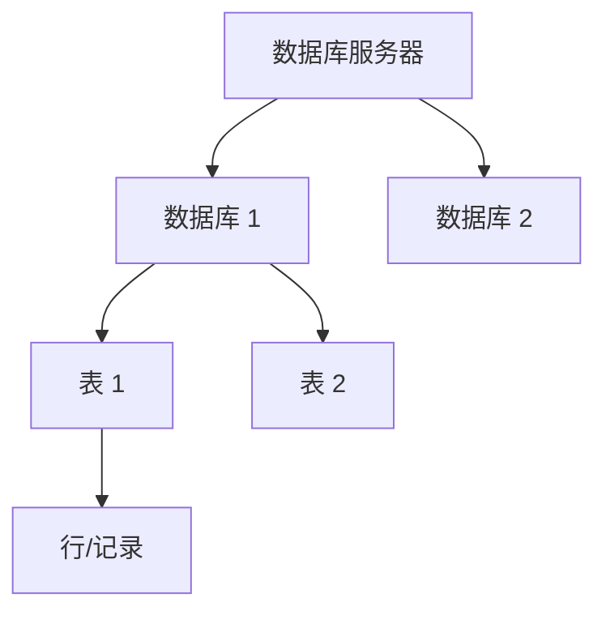

# SQL 语言全解

## 概述

SQL（Structured Query Language）是操作关系型数据库的标准语言。核心工作流：程序员 → SQL 语句 → DBMS → 数据库。

**为什么不用文件存数据？** 并发冲突、查询性能低、维护困难、权限控制难、扩展受限。

### 数据模型



- 一个服务器 → 多个数据库 → 多张表 → 多行数据
- 操作层级：先建库 → 再建表 → 再存数据

### SQL 分类

| 分类 | 全称 | 用途 | 关键字 |
|------|------|------|--------|
| DDL | Data Definition Language | 定义数据库对象（库、表） | CREATE / ALTER / DROP |
| DML | Data Manipulation Language | 增删改表数据 | INSERT / UPDATE / DELETE |
| DQL | Data Query Language | 查询表数据 | SELECT |
| DCL | Data Control Language | 权限控制 | GRANT / REVOKE |

---

## 一、DDL — 数据定义语言

### 1.1 数据库操作

```sql
-- 查询所有数据库
SHOW DATABASES;

-- 查询当前数据库
SELECT DATABASE();

-- 创建数据库（推荐加 IF NOT EXISTS）
CREATE DATABASE IF NOT EXISTS 数据库名 DEFAULT CHARSET utf8mb4;

-- 使用/切换数据库
USE 数据库名;

-- 删除数据库
DROP DATABASE IF EXISTS 数据库名;
```

### 1.2 表操作 — 创建

```sql
CREATE TABLE 表名 (
    字段1  类型  [约束]  [COMMENT '字段注释'],
    字段2  类型  [约束]  [COMMENT '字段注释'],
    ...
    字段n  类型  [约束]  [COMMENT '字段注释']
) COMMENT '表注释';
```

### 1.3 五大约束

| 约束 | 关键字 | 说明 | 示例 |
|------|--------|------|------|
| 非空 | `NOT NULL` | 字段值不允许为 NULL | `name VARCHAR(10) NOT NULL` |
| 唯一 | `UNIQUE` | 字段值不允许重复 | `username VARCHAR(20) UNIQUE` |
| 主键 | `PRIMARY KEY` | 唯一标识 + 非空 + 唯一（每表只有一个） | `id INT PRIMARY KEY` |
| 默认值 | `DEFAULT` | 未指定时使用默认值 | `gender CHAR(1) DEFAULT '男'` |
| 外键 | `FOREIGN KEY` | 关联另一张表的主键，保证数据一致性 | 见下方示例 |

```sql
-- 外键约束示例
CREATE TABLE 订单表 (
    id INT PRIMARY KEY AUTO_INCREMENT,
    user_id INT,
    CONSTRAINT fk_user FOREIGN KEY (user_id) REFERENCES 用户表(id)
);
```

### 1.4 主键自增

```sql
-- auto_increment：每次插入时自动生成主键值，从 1 开始递增
id INT PRIMARY KEY AUTO_INCREMENT
```

### 1.5 数据类型

**数值类型：**

```sql
-- 年龄（不会为负，不会太大）
age TINYINT UNSIGNED

-- 分数（总分100，最多1位小数）
score DOUBLE(4,1)
```

**字符串类型：**

- `CHAR(n)` — 定长，性能更高，适合长度固定的字段（如手机号 `CHAR(11)`）
- `VARCHAR(n)` — 变长，适合长度不固定的字段（如用户名 `VARCHAR(50)`）

**日期时间类型：**

```sql
birthday DATE          -- 只需年月日
createtime DATETIME    -- 精确到时分秒
```

### 1.6 表结构查询与修改

```sql
-- 查询
SHOW TABLES;                    -- 当前库所有表
DESC 表名;                      -- 表结构（字段、类型、约束等）
SHOW CREATE TABLE 表名;         -- 建表语句

-- 修改
ALTER TABLE 表名 ADD 字段名 类型 [COMMENT '注释'] [约束];     -- 添加字段
ALTER TABLE 表名 MODIFY 字段名 新类型;                         -- 修改类型
ALTER TABLE 表名 CHANGE 旧字段名 新字段名 新类型;              -- 改名+改类型
ALTER TABLE 表名 DROP 字段名;                                  -- 删除字段
RENAME TABLE 表名 TO 新表名;                                   -- 改表名

-- 删除
DROP TABLE IF EXISTS 表名;
```

---

## 二、DML — 数据操作语言

### 2.1 INSERT 增加

```sql
-- 指定字段插入
INSERT INTO 表名 (字段1, 字段2) VALUES (值1, 值2);

-- 全字段插入（顺序必须与建表一致）
INSERT INTO 表名 VALUES (值1, 值2, ...);

-- 批量插入
INSERT INTO 表名 (字段1, 字段2) VALUES (值1, 值2), (值1, 值2);

-- now() 获取当前时间
INSERT INTO employee VALUES (NULL, '张三', 1, 1, 5000, '2023-01-01', NOW(), NOW());
```

**注意：** 字段顺序与值一一对应；字符串和日期用引号；数据不能超出字段范围。

### 2.2 UPDATE 修改

```sql
-- 更新指定行（必须加 WHERE）
UPDATE 表名 SET 字段1 = 值1, 字段2 = 值2 WHERE 条件;

-- 不加 WHERE 会更新整张表，慎用
UPDATE employee SET name = '张三丰', update_time = NOW() WHERE id = 1;
```

### 2.3 DELETE 删除

```sql
-- 删除指定行
DELETE FROM 表名 WHERE 条件;

-- 删除整表数据（慎用）
DELETE FROM 表名;
```

**注意：** DELETE 不会重置 AUTO_INCREMENT 计数器。

> `> 🔖 MySQL 特有` TRUNCATE TABLE 可同时清空数据并重置自增计数器，功能等同于 DELETE 全表但效率更高。

---

## 三、DQL — 数据查询语言

### 3.1 查询语法顺序

```sql
SELECT     字段列表
FROM       表名
WHERE      条件
GROUP BY   分组字段
HAVING     分组后条件
ORDER BY   排序字段  ASC/DESC
LIMIT      起始索引, 查询条数;
```

### 3.2 基本查询

```sql
-- 查询指定字段
SELECT name, entry_date FROM employee;

-- 别名
SELECT name AS 姓名, salary AS 薪资 FROM employee;

-- 去重
SELECT DISTINCT job FROM employee;
```

### 3.3 条件查询（WHERE）

```sql
-- 比较运算：=, <>, <, <=, >, >=
SELECT * FROM employee WHERE salary > 15000;

-- AND / OR
SELECT * FROM employee WHERE salary >= 15000 AND gender = 2;

-- BETWEEN ... AND ...（包含两端）
SELECT * FROM employee WHERE entry_date BETWEEN '2020-01-01' AND '2025-01-01';

-- IN（匹配列表中的任意值）
SELECT * FROM employee WHERE job IN (2, 3, 4);

-- LIKE 模糊匹配：% 匹配任意个字符，_ 匹配单个字符
SELECT * FROM employee WHERE name LIKE '李%';      -- 姓李
SELECT * FROM employee WHERE name LIKE '%小%';     -- 包含"小"
SELECT * FROM employee WHERE name LIKE '__';        -- 两个字

-- IS NULL / IS NOT NULL
SELECT * FROM employee WHERE job IS NULL;
```

### 3.4 聚合函数

对一列数据做纵向计算，忽略 NULL 值：

| 函数 | 说明 |
|------|------|
| `COUNT(*)` | 统计行数（推荐） |
| `SUM(字段)` | 求和 |
| `AVG(字段)` | 平均值 |
| `MAX(字段)` | 最大值 |
| `MIN(字段)` | 最小值 |

```sql
-- 示例：统计员工数量和平均薪资
SELECT COUNT(*) AS 员工数, AVG(salary) AS 平均薪资 FROM employee;
```

### 3.5 分组查询（GROUP BY）

```sql
-- 按性别分组，统计人数
SELECT gender, COUNT(*) FROM employee GROUP BY gender;

-- 分组前过滤 + 分组后过滤
SELECT job, COUNT(*)
FROM employee
WHERE entry_date <= '2015-01-01'   -- 分组前（WHERE）
GROUP BY job
HAVING COUNT(*) >= 2;             -- 分组后（HAVING）
```

**WHERE vs HAVING（面试题）：**

- `WHERE` 在分组**前**过滤，不能用聚合函数
- `HAVING` 在分组**后**过滤，可以用聚合函数
- 执行顺序：`WHERE` → 聚合函数 → `HAVING`

### 3.6 排序查询（ORDER BY）

```sql
-- 单字段排序（ASC 升序，DESC 降序，默认 ASC）
SELECT * FROM employee ORDER BY salary DESC;

-- 多字段排序：第一个字段相同才看第二个
SELECT * FROM employee ORDER BY entry_date ASC, salary DESC;
```

### 3.7 分页查询（LIMIT）

> `> 🔖 MySQL 特有` LIMIT 是 MySQL/PostgreSQL 的方言语法，SQL Server 用 `TOP`，Oracle 用 `ROWNUM` 或 `FETCH FIRST`。

```sql
-- 语法：LIMIT 起始索引, 查询条数（起始索引从 0 开始）
SELECT * FROM employee LIMIT 0, 5;   -- 第 1 页，每页 5 条
SELECT * FROM employee LIMIT 5, 5;   -- 第 2 页
SELECT * FROM employee LIMIT 10, 5;  -- 第 3 页

-- 第一页可以省略起始索引
SELECT * FROM employee LIMIT 5;
```

**公式：** `起始索引 = (页码 - 1) × 每页条数`

---

## 四、连接查询

### 4.1 连接分类

| 类型 | 关键字 | 说明 |
|------|--------|------|
| 内连接 | `INNER JOIN ... ON ...` | 返回两表中满足连接条件的交集数据 |
| 左外连接 | `LEFT JOIN ... ON ...` | 返回左表全部数据 + 右表满足条件的数据 |
| 右外连接 | `RIGHT JOIN ... ON ...` | 返回右表全部数据 + 左表满足条件的数据 |
| 自连接 | 同一张表与自身连接 | 用于层级关系查询 |
| 联合查询 | `UNION` / `UNION ALL` | 合并多条 SELECT 的结果 |

### 4.2 内连接

**隐式写法（WHERE 方式）：**

```sql
-- 查询所有员工及其所属部门名称
-- 连接条件：员工表的 dept_id = 部门表的 id
SELECT e.*, d.name AS dept_name
FROM tb_emp e, tb_dept d
WHERE e.dept_id = d.id;
```

**显式写法（INNER JOIN）：**

```sql
SELECT e.*, d.name AS dept_name
FROM tb_emp e
INNER JOIN tb_dept d ON e.dept_id = d.id;
```

> 内连接只返回两表中都满足连接条件的记录，任一表无匹配则不返回。

### 4.3 外连接

```sql
-- 左外连接：查询所有部门及对应员工（包括没有员工的部门）
SELECT d.name, e.name AS emp_name
FROM tb_dept d
LEFT JOIN tb_emp e ON d.id = e.dept_id;

-- 右外连接：查询所有员工及其部门（包括未分配部门的员工）
SELECT d.name, e.name AS emp_name
FROM tb_dept d
RIGHT JOIN tb_emp e ON d.id = e.dept_id;
```

**内连接 vs 外连接：**

| 区别 | 内连接 | 外连接 |
|------|--------|--------|
| 结果集 | 只返回两表交集 | 包含一侧全部记录 |
| NULL 值 | 无 | 非匹配侧填 NULL |
| 使用场景 | 精确关联查询 | 需要保留某一侧完整数据 |

### 4.4 自连接

同一张表与自身连接，常用于层级关系（上下级、树形结构）：

```sql
-- 查询员工及其上级（假设表中有 manager_id 字段指向直属上级）
-- a 表示员工，b 表示其上级
SELECT a.name AS 员工, b.name AS 上级
FROM tb_emp a
LEFT JOIN tb_emp b ON a.manager_id = b.id;
```

### 4.5 联合查询

```sql
-- 合并查询结果（自动去重）
SELECT name, phone FROM tb_emp WHERE job = 2
UNION
SELECT name, phone FROM tb_emp WHERE salary > 10000;

-- 不去重（保留重复行）
SELECT name, phone FROM tb_emp WHERE job = 2
UNION ALL
SELECT name, phone FROM tb_emp WHERE salary > 10000;
```

> `UNION` 自动去重，`UNION ALL` 保留重复。要合并的 SELECT 必须列数相同且类型兼容。

---

## 五、子查询

子查询是嵌套在其他 SQL 语句中的 SELECT 语句，分三类：

### 5.1 标量子查询

子查询返回单个值（数字、字符串、日期），用 `=`、`>`、`<` 等比较：

```sql
-- 查询最早入职的员工信息
SELECT * FROM tb_emp WHERE entry_date = (SELECT MIN(entry_date) FROM tb_emp);

-- 查询在阮小五入职之后入职的员工
SELECT * FROM tb_emp WHERE entry_date > (SELECT entry_date FROM tb_emp WHERE name = '阮小五');
```

### 5.2 列/行子查询

子查询返回多个值，用 `IN`、`NOT IN` 或行比较：

```sql
-- 查询"教研部"和"咨询部"的所有员工
SELECT * FROM tb_emp WHERE dept_id IN (SELECT id FROM tb_dept WHERE name IN ('教研部','咨询部'));

-- 查询与"李忠"薪资和职位都相同的员工
SELECT * FROM tb_emp WHERE (salary, job) = (SELECT salary, job FROM tb_emp WHERE name = '李忠');
```

### 5.3 表子查询

子查询返回多行多列，作为临时表使用：

```sql
-- 查询每个部门中薪资最高的员工
SELECT e.* FROM tb_emp e,
    (SELECT dept_id, MAX(salary) max_sal FROM tb_emp GROUP BY dept_id) a
WHERE e.dept_id = a.dept_id AND e.salary = a.max_sal;
```

---

## 六、多表关系设计

### 6.1 三种表关系概览

| 关系类型 | 场景示例 | 设计原则 |
|----------|----------|----------|
| 一对多 | 部门和员工 | 在多的一方添加外键，指向一的一方主键 |
| 多对多 | 学生和课程 | 新建中间表，包含两个外键分别指向两张主表 |
| 一对一 | 用户和身份证 | 在任意一方添加外键，并设置 UNIQUE 约束 |

### 6.2 一对多

设计原则：
- 一的一方为主表（父表），多的一方为从表（子表）
- 在从表中添加外键列，指向主表的主键，列名通常为 `主表名_主键名`（如 `dept_id`）
- 一张表允许有多个外键列

```sql
-- 创建部门表（主表）
CREATE TABLE dept (
    id   INT PRIMARY KEY COMMENT '部门id',
    name VARCHAR(20) COMMENT '部门名称'
) COMMENT '部门表';

-- 创建员工表（从表），dept_id 为外键，关联 dept.id
CREATE TABLE emp (
    id      INT PRIMARY KEY COMMENT '员工id',
    name    VARCHAR(20) COMMENT '员工姓名',
    dept_id INT COMMENT '部门id，外键关联部门表'
) COMMENT '员工表';
```

**外键约束操作：**

```sql
-- 建表时添加外键
CREATE TABLE emp (
    id      INT PRIMARY KEY,
    name    VARCHAR(20),
    dept_id INT,
    CONSTRAINT dept_id_fk FOREIGN KEY (dept_id) REFERENCES dept(id)
);

-- 建表后添加外键
ALTER TABLE emp ADD CONSTRAINT dept_id_fk FOREIGN KEY(dept_id) REFERENCES dept(id);

-- 删除外键
ALTER TABLE emp DROP FOREIGN KEY dept_id_fk;
```

**物理外键 vs 逻辑外键：**

| 类型 | 实现方式 | 企业实践 |
|------|----------|----------|
| 物理外键 | FOREIGN KEY 约束，数据库层面强制 | 很少使用，部分规范明确禁止 |
| 逻辑外键 | 代码层面维护关联关系，不加数据库约束 | 主流做法，更灵活 |

### 6.3 多对多

设计原则：
- 新建中间表，作为两张主表的从表
- 中间表包含两个外键，分别指向两张主表的主键
- 多对多本质是两个一对多的组合

```sql
-- 学生表
CREATE TABLE student (
    id   INT PRIMARY KEY COMMENT '学号',
    name VARCHAR(30) COMMENT '姓名'
) COMMENT '学生表';

-- 课程表
CREATE TABLE course (
    id   INT PRIMARY KEY COMMENT '课程编号',
    name VARCHAR(30) COMMENT '课程名称'
) COMMENT '课程表';

-- 中间表：两个外键分别关联 student 和 course
CREATE TABLE student_course (
    id         INT PRIMARY KEY AUTO_INCREMENT COMMENT 'id',
    student_id INT COMMENT '学号，外键关联 student.id',
    course_id  INT COMMENT '课程编号，外键关联 course.id'
) COMMENT '学生课程中间表';
```

### 6.4 一对一

设计原则：
- 在任意一方添加外键，关联另一方的主键
- 外键必须加 UNIQUE 约束，保证一对一关系

```sql
-- 用户基本信息表
CREATE TABLE tb_user (
    id     INT UNSIGNED PRIMARY KEY AUTO_INCREMENT COMMENT 'ID',
    name   VARCHAR(10) NOT NULL COMMENT '姓名',
    gender TINYINT UNSIGNED NOT NULL COMMENT '性别, 1 男  2 女',
    phone  CHAR(11) COMMENT '手机号',
    degree VARCHAR(10) COMMENT '学历'
) COMMENT '用户基本信息表';

-- 用户身份信息表：user_id 为外键，UNIQUE 保证一对一
CREATE TABLE tb_user_card (
    id           INT UNSIGNED PRIMARY KEY AUTO_INCREMENT COMMENT 'ID',
    nationality  VARCHAR(10) NOT NULL COMMENT '民族',
    birthday     DATE NOT NULL COMMENT '生日',
    idcard       CHAR(18) NOT NULL COMMENT '身份证号',
    issued       VARCHAR(20) NOT NULL COMMENT '签发机关',
    expire_begin DATE NOT NULL COMMENT '有效期限-开始',
    expire_end   DATE COMMENT '有效期限-结束',
    user_id      INT UNSIGNED NOT NULL UNIQUE COMMENT '用户ID，唯一约束保证一对一'
) COMMENT '用户身份信息表';
```

---

## 七、事务

### 7.1 概念

事务是一组不可分割的操作集合，要么全部成功，要么全部失败。

**典型场景：** 银行转账、下单扣库存、涨薪+记日志。

**MySQL 默认自动提交：** 执行一条 DML 语句就会立即提交。

### 7.2 操作

```sql
-- 开启事务
START TRANSACTION;  -- 或 BEGIN;

-- 执行业务操作
UPDATE employee SET salary = salary + 2000 WHERE id = 5;
INSERT INTO employee_log(employee_id, operation, create_time)
    VALUES (5, 'update', NOW());

-- 全部成功 → 提交
COMMIT;

-- 任一失败 → 回滚（撤销所有操作）
ROLLBACK;
```

### 7.3 ACID 四大特性

| 特性 | 英文 | 说明 |
|------|------|------|
| 原子性 | Atomicity | 事务中的操作要么全部成功，要么全部失败 |
| 一致性 | Consistency | 事务完成后数据保持一致状态 |
| 隔离性 | Isolation | 多个并发事务互不干扰 |
| 持久性 | Durability | 事务提交/回滚后，数据改变是永久的 |

---

## 八、综合练习

多表查询的一般步骤：
1. 确定使用哪几张表，写出连接查询语句
2. 确定业务条件，添加 WHERE
3. 确定显示字段，修改 SELECT

```sql
-- 1. 查询"教研部"性别为男，且在"2011-05-01"之后入职的员工
SELECT e.* FROM tb_emp e, tb_dept d
WHERE e.dept_id = d.id
  AND d.name = '教研部' AND e.gender = 1 AND e.entry_date > '2011-05-01';

-- 2. 查询工资低于公司平均工资且性别为男的员工
SELECT e.* FROM tb_emp e, tb_dept d
WHERE e.dept_id = d.id
  AND e.salary < (SELECT AVG(salary) FROM tb_emp)
  AND e.gender = 1;

-- 3. 查询部门人数超过10人的部门名称
SELECT d.name, COUNT(*) AS cnt
FROM tb_emp e, tb_dept d
WHERE e.dept_id = d.id
GROUP BY d.name
HAVING COUNT(*) > 10;

-- 4. 查询2010-05-01后入职、薪资高于10000的教研部员工，按薪资倒序
SELECT * FROM tb_emp e, tb_dept d
WHERE e.dept_id = d.id
  AND e.entry_date > '2010-05-01'
  AND e.salary > 10000
  AND d.name = '教研部'
ORDER BY e.salary DESC;

-- 5. 查询工资低于本部门平均工资的员工
SELECT e.* FROM tb_emp e,
    (SELECT dept_id, AVG(salary) avg_sal FROM tb_emp GROUP BY dept_id) a
WHERE e.dept_id = a.dept_id AND e.salary < a.avg_sal;
```

---

## 最佳实践

- 建表时用 `IF NOT EXISTS` / `IF EXISTS` 避免重复操作报错
- 字段都加 `COMMENT` 注释，方便维护
- 主键统一用 `INT UNSIGNED AUTO_INCREMENT`
- 公共字段：`create_time`、`update_time` 记录操作时间
- 修改/删除数据**必须加 WHERE 条件**，否则影响整表
- 查询用 `SELECT 具体字段` 而非 `SELECT *`，更直观高效
- 分组查询的 SELECT 字段一般只放聚合函数和分组字段
- 涉及多步操作的业务必须用事务包裹
- 企业开发中优先使用逻辑外键，避免物理外键带来的级联问题

## 常见问题

| 问题 | 原因 | 解决方案 |
|------|------|----------|
| 插入数据报主键重复 | 未使用 `AUTO_INCREMENT` | 主键加 `AUTO_INCREMENT` |
| UPDATE/DELETE 没加 WHERE 改了全表 | 忘记加 WHERE 条件 | 始终带上 WHERE，执行前检查 |
| GROUP BY 报错 | SELECT 了非分组字段 | 只选聚合函数和分组字段 |
| LIKE 模糊查询没结果 | `%` 放错位置 | `%keyword%` 包含匹配 |
| 分页第一页数据重复 | 起始索引计算错误 | `索引 = (页码-1) × 条数` |
| 事务未回滚 | MySQL 默认自动提交 | 操作前 `START TRANSACTION` |
