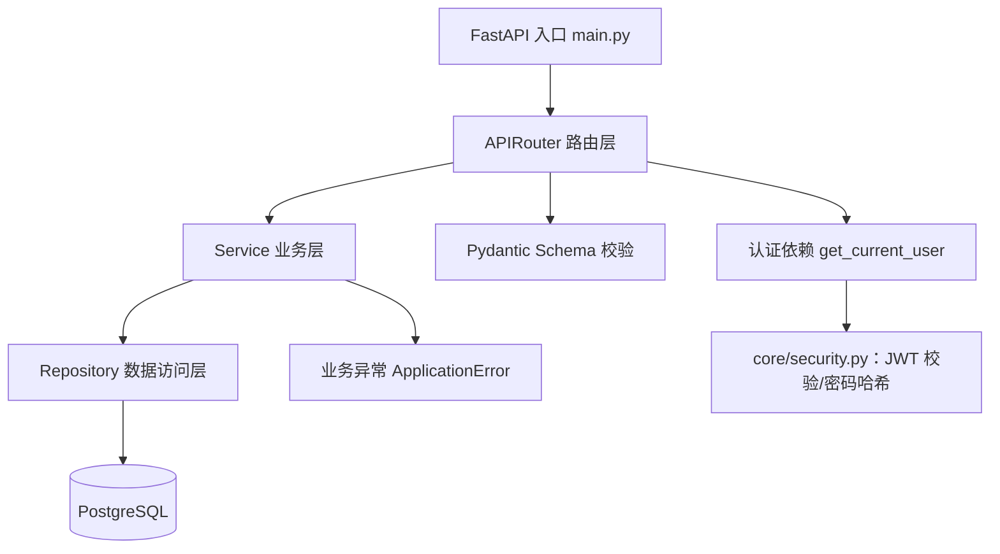
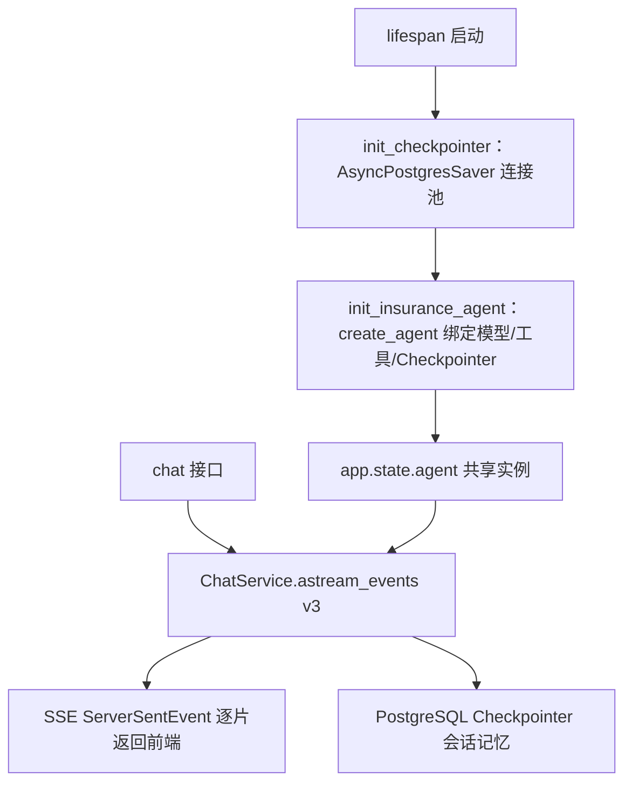

---
title: AgentService - 保险AI智能体服务（学习项目）
tags: [项目导航, FastAPI, Python, AI, LangChain, 后端]
created: 2026-08-09
---

# AgentService 项目导航

## 项目概述
这是 **保险 AI 智能体服务**（hm-insurance 的 agent-service）后端学习项目。已实现 FastAPI 分层后端骨架（配置、日志、异步数据库、保险产品分页查询、客服会话 CRUD、JWT 认证），并已落地 **LangChain Agent 基础能力**：保险顾问 Agent + PostgreSQL Checkpointer 会话记忆 + SSE 流式对话 + 保险产品查询工具。

## 技术栈
- **Web 框架**: FastAPI 0.139 + uvicorn
- **数据库**: PostgreSQL（asyncpg 异步驱动 + psycopg 连接池）
- **ORM**: SQLAlchemy 2.0 异步模式
- **配置**: Pydantic Settings（.env 分层配置）
- **日志**: structlog（彩色控制台）
- **认证**: PyJWT（HS256）+ pwdlib（Argon2 密码哈希）
- **Agent**: LangChain 1.3（create_agent）+ LangGraph（checkpoint-postgres）
- **模型**: DeepSeek（langchain-deepseek 接入，init_chat_model）
- **流式对话**: FastAPI SSE（EventSourceResponse / ServerSentEvent）
- **包管理**: uv（清华源）
- **Python**: >=3.11
- **已声明未使用**: MCP adapters

## 项目结构
```
agent-service/
├── pyproject.toml          # uv 项目与依赖配置
├── .env                    # 应用/数据库/模型配置（不入库）
├── note/                   # 学习 Notebook（LangChain、Checkpointer 等）
└── app/
    ├── main.py             # 应用入口：lifespan（DB+Checkpointer+Agent）、CORS、路由、健康检查、异常处理器
    ├── core/
    │   ├── config.py       # Pydantic 分层配置（App/Database/LLM/JWT/Logging）
    │   ├── logging.py      # structlog 日志配置
    │   ├── security.py     # 密码哈希 + JWT 签发/校验工具
    │   └── exceptions.py   # 业务异常基类
    ├── common/
    │   ├── models.py       # ORM 基类 Base + 时间戳混入类
    │   └── schemas.py      # Pydantic 基类 + 泛型分页 PageResult
    ├── infra/
    │   ├── database.py     # 异步引擎、会话工厂、依赖注入
    │   └── checkpointer.py # Checkpointer 连接池（AsyncPostgresSaver）生命周期
    ├── agents/
    │   ├── insurance_advisor.py  # 保险顾问 Agent 初始化（create_agent）
    │   └── tools.py              # Agent 工具（@tool 异步产品查询）
    └── modules/            # 业务模块（Router → Service → Repository）
        ├── product/        # 保险产品分页查询（公开接口）
        ├── chat_thread/    # 客服会话 CRUD + 历史读取/删除（aget_state/adelete_thread）
        ├── chat/           # AI 对话接口（astream_events v3 + SSE 流式）
        └── auth/           # 用户注册/登录 + JWT 身份认证依赖
```

## 知识点目录
- [[FastAPI 应用与路由]]
- [[Pydantic 配置与模型]]
- [[SQLAlchemy 异步操作]]

- [[日志与异常处理]]
- [[业务模块标准写法]]
- [[AI 接口集成]]
- [[用户认证与鉴权]]
- [[LangChain 基础与模型]]
- [[LangChain Agent 开发]]
- [[LangChain 记忆与持久化]]
- [[MCP 集成]]
- [[标准智能体可复用模板]] —— 智能体服务标准架构模板：Agent + 工具 + 记忆 + SSE
- [[SSE 流式响应]]
- [[Milvus 基础概念]]
- [[Milvus 数据操作与检索]]
- [[Milvus 混合检索与重排]]
- [[LangChain-Milvus 集成]]

## 技术架构


Agent 能力调用链：


- 每个业务模块四层职责：`router`（HTTP 参数/依赖注入）→ `service`（事务与业务规则）→ `repository`（SQL 查询）→ `models`（ORM 表映射）
- `agents/` 负责 Agent 初始化与工具，`infra/` 存放基础设施（数据库/Checkpointer 连接）

## 快速开始
```bash
cd D:\Object\AXB\hm-insurance\agent-service
uv sync          # 安装依赖（清华源）
# 配置 .env 中的 DB_HOST/DB_PORT/DB_NAME/DB_USER/DB_PASSWORD/LLM 配置
uv run python -m app.main   # Windows 下必须用 -m 启动（内部设置了 SelectorEventLoop）
```

验证：
```bash
curl http://127.0.0.1:8001/health
# {"status":"ok"}
```

## 已完成 / 待完成
**已完成**
- [x] uv 项目初始化与依赖声明
- [x] 分层配置（应用/数据库/模型/日志）
- [x] structlog 彩色日志
- [x] PostgreSQL 异步连接池 + 健康检查
- [x] ORM 基类、时间戳混入
- [x] 保险产品分页查询接口
- [x] 客服会话 CRUD（创建/列表/重命名）
- [x] 业务异常定义
- [x] 全局异常处理器（ApplicationError → JSON 响应）
- [x] 用户注册/登录 + JWT 身份认证（auth 模块）
- [x] 密码哈希（pwdlib/Argon2）与 JWT 工具（core/security.py）
- [x] 客服会话模块接入真实 JWT 认证（替代 x-user-id）
- [x] LangChain Agent 初始化（create_agent + init_chat_model + system_prompt）
- [x] PostgreSQL Checkpointer（AsyncPostgresSaver + psycopg 连接池 + lifespan 生命周期）
- [x] Agent 流式对话接口（astream_events v3 + SSE 逐片返回）
- [x] 会话历史读取/删除（aget_state / adelete_thread + 归属校验）
- [x] 保险产品查询工具（@tool 异步工具，接入 ProductService）

**待完成（未实现）**
- [ ] 保险方案生成与保存（结构化输出 + Context 注入 + 人工确认）
- [ ] MCP 服务接入（依赖已声明未使用）
- [ ] 数据库迁移工具（Alembic）与建表脚本
- [ ] 测试用例
- [ ] product 模块仍为公开接口，未接入认证
