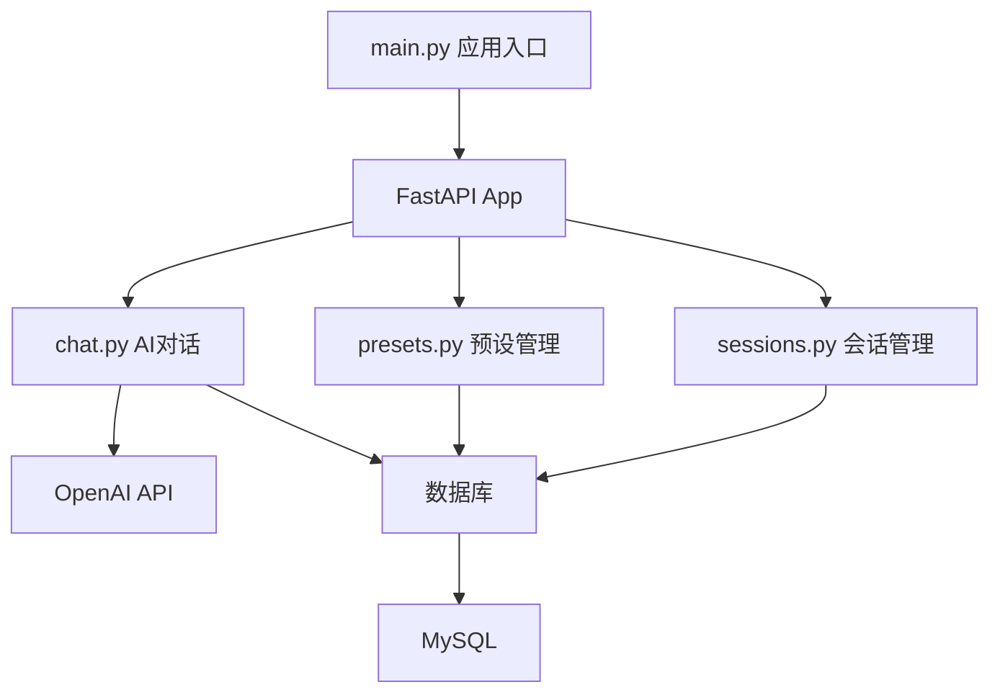

---
title: FastAPIProject - AI伴侣聊天应用
tags: [项目导航, FastAPI, Python, AI]
created: 2026-08-06
---

# FastAPIProject 项目导航

## 项目概述
这是一个基于 FastAPI 构建的 **AI 伴侣聊天应用**（"AI智能伴侣"）。用户可以选择不同性格的 AI 伴侣进行对话，系统会根据伴侣的性格设定生成回复，模拟真实伴侣聊天体验。

## 技术栈
- **Web 框架**: FastAPI
- **数据库**: MySQL（通过 aiomysql 异步驱动）
- **ORM**: SQLAlchemy 2.0（异步模式）
- **AI 接口**: OpenAI API（小米 MiMo 模型）
- **包管理**: uv
- **Python**: 3.14+

## 项目结构
```
FastAPIProject/
├── main.py                  # 应用入口
├── pyproject.toml           # 项目依赖配置
├── app/
│   ├── core/
│   │   ├── config.py        # 配置管理
│   │   ├── database.py      # 数据库连接
│   │   └── logging.py       # 日志配置
│   ├── models/
│   │   └── models.py        # 数据库模型
│   ├── routers/
│   │   ├── chat.py          # AI对话接口
│   │   ├── presets.py       # 伴侣预设接口
│   │   └── sessions.py     # 会话管理接口
│   └── schemas/
│       └── schemas.py       # Pydantic 数据模型
└── static/
    ├── index.html           # 前端页面
    ├── app.js               # 前端逻辑
    └── style.css            # 样式
```

## 核心架构


## 知识点目录（可复用知识库）
- [[FastAPI 应用与路由]]
- [[Pydantic 配置与模型]]
- [[SQLAlchemy 异步操作]]

- [[日志与异常处理]]
- [[业务模块标准写法]]
- [[AI 接口集成]]
## 快速开始
1. 安装依赖: `uv sync`
2. 配置数据库连接（修改 `app/core/config.py`）
3. 设置环境变量 `MIMO_API_KEY`
4. 启动: `python main.py`
5. 访问 `http://192.168.33.93:8000`

